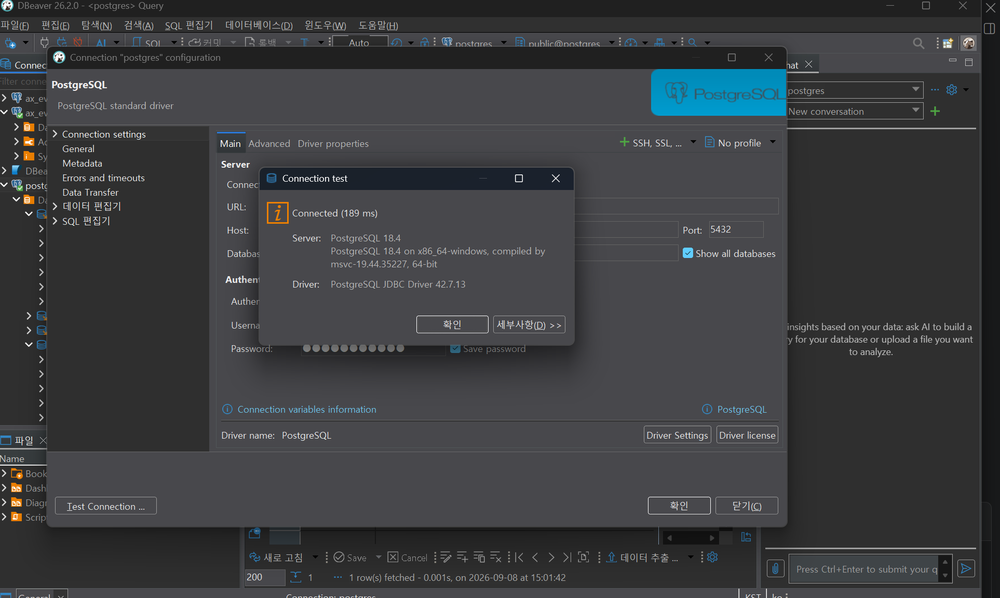
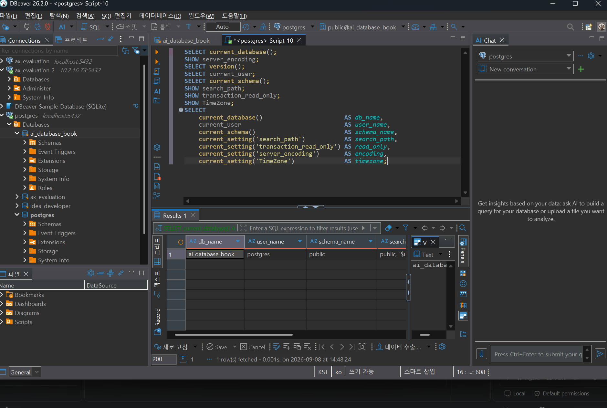
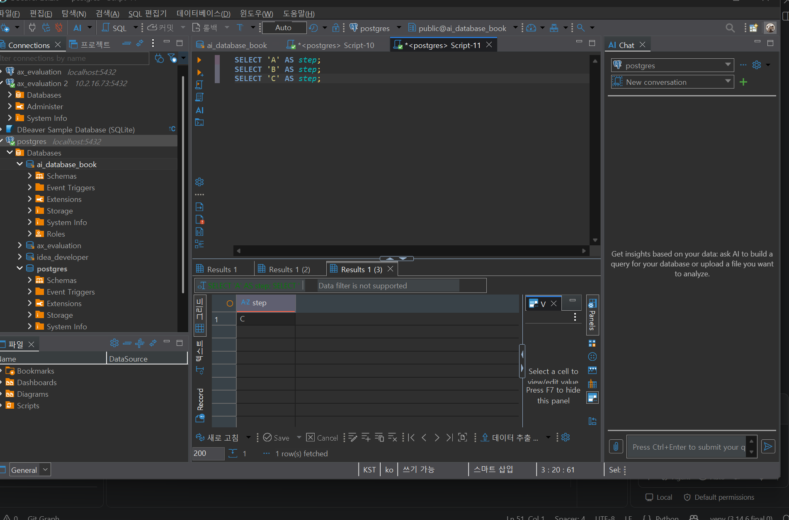

# Chapter 03 확장 실습 답안

> **과제:** PostgreSQL과 DBeaver로 실습 환경 검증하기
> **제출 방법:** LMS에는 본인 GitHub 저장소의 `chapter03_answer.md` 파일 URL을 제출합니다.

---

## 제출 전 보안 주의

이 과제 파일과 캡처 화면에는 다음 정보를 올리지 않습니다.

```text
실제 PostgreSQL 비밀번호
전체 DB 접속 URL
API Key / Token
개인정보
공개할 필요가 없는 사내 서버 주소
```

```text
GitHub 계정 또는 별칭: apll970502
과제 작성일: 2026-09-08
사용한 AI 도구: Claude (오류 분석 보조 및 결과 해석 검토)
```

---

# 1. PostgreSQL과 DBeaver 환경 확인

## 1-1. 내 환경

| 항목 | 작성 내용 |
| --- | --- |
| 운영체제 | Windows 11 Pro |
| PostgreSQL 버전 | 18.4 (x86_64-windows, `server_version_num` = 180004) |
| DBeaver 버전 | 26.2.0 (Community) |
| Host | `localhost` |
| Port | `5432` |
| Database | `ai_database_book` |
| Username | `postgres` |

> 비밀번호는 기록하지 않습니다.

## 1-2. PostgreSQL과 DBeaver 역할 설명

```text
PostgreSQL은:
데이터를 실제로 저장하고 관리하는 서버 프로그램(DBMS)이다.
내 PC에서 postgresql-x64-18 이라는 윈도우 서비스로 계속 실행되고 있고,
5432번 포트에서 연결 요청을 기다린다.
DBeaver를 꺼도 PostgreSQL은 계속 돌아간다.

DBeaver는:
그 서버에 접속해서 SQL을 보내고 결과를 표로 보여주는 클라이언트 프로그램이다.
데이터를 직접 갖고 있지 않으며, 화면에 보이는 표는 서버가 돌려준 결과일 뿐이다.

두 프로그램의 차이는:
데이터를 "가지고 있는 쪽"과 "요청하는 쪽"의 차이다.
그래서 DBeaver를 지워도 데이터는 사라지지 않고,
DBeaver 연결이 성공했다는 것이 곧 원하는 데이터베이스에 붙었다는 뜻도 아니다.
```

---

# 2. 연결 테스트와 첫 SQL

## 2-1. DBeaver 연결 결과

- [x] PostgreSQL 연결 유형 선택
- [x] Host 확인
- [x] Port 확인
- [x] Database 확인
- [x] Username 확인
- [x] Test Connection 성공

### 연결 성공 화면



Test Connection 결과 `Connected (189 ms)`가 표시되었고, 서버가 반환한 정보는 다음과 같다.

```text
Server: PostgreSQL 18.4 on x86_64-windows, compiled by msvc-19.44.35227, 64-bit
Driver: PostgreSQL JDBC Driver 42.7.13
```

비밀번호 칸은 마스킹(●) 상태이며, 전체 접속 URL은 팝업창에 가려져 화면에 노출되지 않았다.

## 2-2. 첫 SQL 실행

```sql
SELECT 1 + 1 AS result;
```

실행 전 예상:

```text
2
```

실제 결과:

```text
2
```

이 결과가 의미하는 것:

```text
DBeaver에서 작성한 SQL이 PostgreSQL까지 전달되고,
서버가 계산한 결과가 다시 DBeaver 화면에 표시되는 왕복 경로가 정상이라는 뜻이다.

다만 이것만으로는 "ai_database_book에 연결되었다"고 말할 수 없다.
1 + 1 계산은 어느 데이터베이스에 붙어 있든 똑같이 2를 반환하기 때문이다.
실제 연결 위치는 3번 항목에서 별도로 확인했다.
```

---

# 3. 현재 연결 위치를 SQL로 검증

다음 SQL을 실행합니다.

```sql
SELECT version();
SELECT current_database();
SELECT current_user;
SELECT current_schema();
SHOW search_path;
SHOW transaction_read_only;
SHOW TimeZone;
```

## 3-1. 결과 기록

| 확인 항목 | 실제 결과 | 내가 이해한 의미 |
| --- | --- | --- |
| `version()` | PostgreSQL 18.4 on x86_64-windows, compiled by msvc-19.44.35227, 64-bit | 설치 목록에 적힌 버전이 아니라, 지금 접속한 서버가 직접 답한 버전이다 |
| `current_database()` | `ai_database_book` | 현재 세션이 붙어 있는 데이터베이스 이름 |
| `current_user` | `postgres` | 현재 세션의 사용자. 권한 문제를 볼 때 기준이 되는 값 |
| `current_schema()` | `public` | 스키마를 생략했을 때 기본으로 사용되는 스키마 |
| `search_path` | `public, "$user"` | 스키마를 생략했을 때 찾아보는 순서 목록 |
| `transaction_read_only` | `off` | 이 세션이 읽기 전용이 아니라는 뜻 |
| `TimeZone` | `Asia/Seoul` | 시각 값을 표시할 때 기준이 되는 시간대 |

추가로 `SHOW server_encoding;`을 실행해 `UTF8`을 확인했다. Chapter 04에서 한글 데이터를 입력하기 때문에 미리 확인했다.

## 3-2. 반드시 설명할 것

### DBeaver 연결 이름과 `current_database()`는 왜 같은 개념이 아닌가요?

```text
DBeaver 연결 이름은 내가 화면에서 알아보기 쉬우라고 붙인 별칭일 뿐이고,
서버는 그 이름을 전혀 모른다.

실제로 이번 실습에서 "postgres"라는 이름의 연결을 사용했는데,
그 연결의 Database 항목을 ai_database_book으로 바꾼 뒤에도
연결 이름은 계속 "postgres"로 남아 있었다.
이름만 보면 postgres DB에 붙어 있는 것처럼 보이지만
current_database()는 ai_database_book을 반환했다.

반대의 경우가 더 위험하다.
연결 이름을 "수업 DB"라고 붙여 두고 안심했는데
실제 Database 항목이 postgres로 남아 있으면
엉뚱한 곳에 테이블을 만들게 된다.

그래서 이름은 사람이 붙인 라벨, current_database()는 서버가 답한 사실이고,
믿어야 하는 것은 후자다.
```

### `current_schema()`와 `search_path`는 어떤 관계가 있나요?

```text
search_path는 "스키마 이름을 생략했을 때 어떤 순서로 찾아볼지" 정한 목록이고,
current_schema()는 그 목록에서 실제로 사용할 수 있는 첫 번째 스키마를 반환한다.

내 환경에서는 search_path가 public, "$user" 였고
current_schema()는 public이 나왔다.

여기서 흔히 하는 오해는
"current_schema()가 public이니까 이 데이터베이스에는 public만 있다"고 생각하는 것이다.
이것은 틀린 해석이다.
current_schema()는 어디까지나 기본값이 무엇인지 알려줄 뿐이고,
데이터베이스에 어떤 스키마가 더 있는지는 별도로 조회해야 한다.

실제로 이번 실습에서 postgres 데이터베이스의 스키마 목록을 열어보니
public 말고도 practice, idea_developer 스키마가 함께 존재했다.

그래서 앞으로는 대상을 분명히 하기 위해
students가 아니라 public.students 처럼 스키마를 붙여서 쓴다.
```

### `transaction_read_only = off`라는 결과만으로 모든 테이블을 만들 권한이 있다고 단정할 수 있나요?

```text
단정할 수 없다. 두 가지는 서로 다른 층위의 문제다.

transaction_read_only = off 는
"이 세션이 읽기 전용 모드가 아니다" 라는 세션 설정에 관한 사실이다.

반면 테이블을 만들 수 있는지는
"이 사용자가 이 스키마에 대해 CREATE 권한을 가지고 있는가" 라는 권한의 문제다.
읽기 전용이 아니어도 특정 스키마에 CREATE 권한이 없으면 테이블을 만들 수 없다.

이번 실습에서 setup_check.sql이 이 둘을 실제로 따로 검사한다는 것을 확인했다.
transaction_read_only 를 보는 항목과
has_schema_privilege(current_user, 'public', 'CREATE') 를 보는 항목이
서로 다른 컬럼으로 나뉘어 있었다.

내 환경에서는 두 조건이 모두 만족되어
transaction_read_only = off 이고 public_schema_create_ok = true 였다.
따라서 Chapter 04에서 public.students를 만들 수 있다.
```

## 3-3. 증거 화면



여러 결과 탭에 흩어져 있으면 한 장에 담기지 않아서,
`current_setting()` 함수를 사용해 한 행으로 묶어 조회했다.
`SHOW`는 단독 명령이라 다른 SQL과 합칠 수 없지만,
`current_setting('search_path')` 처럼 함수 형태를 쓰면 `SELECT` 안에 넣을 수 있다.

```sql
SELECT
    current_database()                       AS db_name,
    current_user                             AS user_name,
    current_schema()                         AS schema_name,
    current_setting('search_path')           AS search_path,
    current_setting('transaction_read_only') AS read_only,
    current_setting('server_encoding')       AS encoding,
    current_setting('TimeZone')              AS timezone;
```

---

# 4. `ai_database_book` 데이터베이스 확인

## 4-1. 현재 데이터베이스

```sql
SELECT current_database();
```

실제 결과:

```text
처음 실행했을 때: postgres
데이터베이스 생성 및 연결 전환 후: ai_database_book
```

- [x] 결과가 `ai_database_book`이다.
- [x] 다른 DB라면 올바른 연결로 전환했다.

## 4-2. 연결을 바꾼 뒤 다시 검증

```text
전환 전 데이터베이스: postgres

전환 후 데이터베이스: ai_database_book

전환 여부를 판단한 근거:
화면의 연결 이름이나 트리 표시가 아니라, SELECT current_database(); 를 다시 실행해서
서버가 반환한 값이 ai_database_book으로 바뀐 것을 직접 확인했다.
DBeaver 상단 표시도 public@postgres 에서 public@ai_database_book 으로 바뀌었다.
```

이번 실습에서 실제로 거친 과정은 다음과 같다.

```text
1. SELECT current_database(); 실행 -> postgres 가 나옴. 원하는 DB가 아님을 확인.

2. 이름이 다르다고 바로 만들지 않고, 서버에 이미 존재하는지 먼저 조회함.
   SELECT datname FROM pg_database WHERE datistemplate = false ORDER BY datname;
   -> 목록에 ai_database_book 이 없음을 확인.

3. 존재하지 않는 것을 확인한 뒤에만 생성함.
   CREATE DATABASE ai_database_book;

4. 두 번째로 실행했을 때는
   database "ai_database_book" already exists 오류가 발생했다.
   이 오류는 실패가 아니라 이미 생성에 성공했다는 증거였다.

5. DBeaver 트리에 바로 보이지 않아 새로 고침(F5)이 필요했다.
   트리는 캐시된 목록이고, pg_database 조회 결과가 더 정확한 증거였다.

6. 만드는 것과 그 DB로 옮겨가는 것은 별개 작업이었다.
   생성 직후에도 current_database()는 여전히 postgres였고,
   ai_database_book을 활성 데이터베이스로 지정한 뒤에야 값이 바뀌었다.
```

### 화면에서 보이는 연결 이름만 믿지 않고 SQL을 다시 실행해야 하는 이유

```text
화면에 보이는 것은 세 종류이고 셋 다 서버의 현재 상태와 어긋날 수 있다.

첫째, 연결 이름은 내가 붙인 별칭이라 실제 Database 항목과 무관하다.
둘째, 트리 목록은 캐시라서 서버에서 일어난 변경이 바로 반영되지 않는다.
   실제로 CREATE DATABASE 직후 트리에 ai_database_book이 보이지 않았고,
   F5로 새로 고침한 뒤에야 나타났다.
셋째, 설정 화면에서 값을 바꿔도 연결이 다시 열리기 전까지는 적용되지 않을 수 있다.

반면 SELECT current_database()는 지금 이 세션이 실제로 붙어 있는 곳을
서버가 직접 답해주는 값이다.
Chapter 04부터는 UPDATE와 DELETE로 데이터를 실제로 바꾸기 때문에,
"어디에서 실행되는가"를 화면이 아니라 SQL로 확정하는 습관이 필요하다.
```

---

# 5. SQL 실행 범위 실험

SQL Editor에 다음 세 문장을 입력합니다.

```sql
SELECT 'A' AS step;
SELECT 'B' AS step;
SELECT 'C' AS step;
```

## 5-1. 한 문장 실행

```text
내가 실행한 문장: SELECT 'A' AS step; (커서를 첫 줄에 두고 Ctrl+Enter)

실제 결과: 결과 탭 1개. 값은 A 하나만 반환됨.
          편집기에 세 문장이 모두 있는데도 나머지 두 문장은 실행되지 않았다.
```

## 5-2. 선택 영역 실행

```text
선택한 문장: SELECT 'A' AS step; 와 SELECT 'B' AS step; 두 줄을 드래그로 선택

실제 결과: 결과 탭 2개. A와 B만 실행되고 C는 실행되지 않았다.
```

## 5-3. 전체 스크립트 실행

```text
실제 결과: 결과 탭 3개 (Results 1, Results 1 (2), Results 1 (3))
          A, B, C가 각각 별도의 결과 탭으로 표시되었다.

결과 탭 또는 실행 순서에서 관찰한 점:
문장은 위에서 아래로 순서대로 실행되고, 각 문장마다 결과 탭이 하나씩 늘어난다.
따라서 결과 탭의 개수를 세면 몇 문장이 실행되었는지 역으로 확인할 수 있다.
```

## 5-4. 결과 해석

```text
한 문장 실행과 전체 스크립트 실행의 차이:
편집기에 적혀 있는 SQL의 양과 실제로 실행되는 SQL의 양은 다르다.
커서 위치와 선택 영역이 실행 범위를 결정하며,
전체 실행은 파일에 있는 모든 문장을 위에서부터 전부 보낸다.

변경 SQL에서 실행 범위를 잘못 선택하면 위험한 이유:
조회문만 확인하려고 했는데 아래에 UPDATE나 DELETE가 함께 적혀 있으면
전체 실행 한 번으로 데이터가 실제로 바뀌거나 지워진다.
문법 오류가 아니기 때문에 아무 경고도 없이 성공적으로 실행된다.

특히 DBeaver 상단이 Auto(자동 커밋)로 되어 있으면
실행하는 즉시 확정되어 롤백으로 되돌릴 수 없다.
내 환경도 Auto 상태였다.

그래서 앞으로 SQL을 실행하기 전에 세 가지를 확인한다.
1. 지금 어느 데이터베이스에 연결되어 있는가
2. 지금 선택한 실행 범위는 어디까지인가
3. 그 범위 안에 데이터를 변경하는 SQL이 포함되어 있는가
```

### 증거 화면



---

# 6. 제공된 환경 확인 SQL 실행

Public 저장소의 Chapter 03 파일을 사용합니다.

```text
code/chapter03/setup_check.sql
code/chapter03/setup_validate_local.sql
```

## 6-1. `setup_check.sql`

실행 전에 예상한 값은 다음과 같다.

```text
current_database 예상: ai_database_book
transaction_read_only 예상: off
1 + 1 예상: 2
```

실행 결과에서 확인한 항목:

```text
PostgreSQL 버전: PostgreSQL 18.4 on x86_64-windows, 64-bit
현재 DB: ai_database_book
현재 사용자: postgres
현재 스키마: public
search_path: public, "$user"
읽기 전용 여부: off
TimeZone: Asia/Seoul
1 + 1 결과: 2
public 스키마 존재 여부: true
public USAGE 권한: true
public CREATE 권한: true
```

10번 요약 문장의 판정 컬럼은 다음과 같이 모두 `true`였다.

| 판정 항목 | 결과 |
| --- | --- |
| `recommended_database_name_ok` | true |
| `public_schema_exists` | true |
| `public_schema_usage_ok` | true |
| `public_schema_create_ok` | true |
| `sql_execution_ok` | true |

예상과 실제 결과가 세 항목 모두 일치했다.

### 이 파일을 여러 번 실행해도 비교적 안전한 이유

```text
파일을 열어서 내용을 직접 읽어본 결과,
이 파일에는 SELECT와 SHOW만 있고
DROP, DELETE, UPDATE, INSERT, ALTER, TRUNCATE 같은 문장이 하나도 없었다.

조회문은 서버에 저장된 데이터를 읽기만 하고 바꾸지 않기 때문에
몇 번을 실행해도 결과가 같고 데이터 상태가 달라지지 않는다.

다만 "안전하다"는 판단의 근거는 파일 이름이 아니라 파일 내용이다.
setup_check라는 이름만 보고 안전하다고 믿으면 안 되고,
AI나 인터넷에서 받은 SQL도 마찬가지로 실행 전에 열어서 읽어야 한다.
```

## 6-2. `setup_validate_local.sql`

```text
실행 결과: 오류 없이 정상 종료되었다.
          첫 결과 행에 server_version_num = 180004,
          database_name = ai_database_book, user_name = postgres 가 표시되었다.

PASS / FAIL: PASS
```

이 파일은 PASS/FAIL을 컬럼으로 출력하지 않고,
조건이 하나라도 맞지 않으면 `RAISE EXCEPTION`으로 즉시 중단하는 구조였다.
따라서 **오류 없이 끝났다는 것 자체가 PASS**를 의미한다.
성공 시 마지막에 다음 메시지를 남긴다.

```text
Chapter 03 recommended local environment validation passed
```

통과한 조건은 다음 8가지였다.

| # | 검사 항목 | 결과 |
| --- | --- | --- |
| 1 | PostgreSQL 15 이상 (`server_version_num >= 150000`) | 180004 → 통과 |
| 2 | 현재 DB가 `ai_database_book` | 통과 |
| 3 | 현재 DB에 대한 CONNECT 권한 | 통과 |
| 4 | `public` 스키마 존재 | 통과 |
| 5 | `public` 스키마 USAGE 권한 | 통과 |
| 6 | `public` 스키마 CREATE 권한 | 통과 |
| 7 | 읽기 전용 연결이 아님 | 통과 |
| 8 | `1 + 1 = 2` | 통과 |

실패했다면 실패 항목:

```text
없음. 8개 조건 모두 통과했다.
```

그 실패가 실제 문제인지 환경 차이인지 판단한 근거:

```text
이번에는 실패가 없었지만, 만약 FAIL이 발생했다면 판단 순서는 다음과 같다.

첫째, 어떤 조건에서 멈췄는지 예외 메시지를 읽는다.
이 파일은 실패한 조건마다 다른 메시지를 출력하도록 만들어져 있어서
어느 단계에서 걸렸는지 바로 알 수 있다.

둘째, 그것이 내 환경이 고장난 것인지, 아니면 기대 조건과 다른 것뿐인지 구분한다.
예를 들어 데이터베이스 이름이 다른 것은 고장이 아니라 연결 선택의 문제이고,
관리형 PostgreSQL을 쓰는 경우 권한 구조가 로컬 기준과 다를 수 있다.

셋째, 그 조건이 수업 진행에 실제로 필요한지 판단한다.
Chapter 04에서 public.students를 만들어야 하므로 CREATE 권한 실패는 해결해야 하지만,
TimeZone 차이 같은 것은 수업 진행을 막지 않는다.

검증 실패를 곧바로 "재설치"로 연결하지 않는 것이 중요하다.
```

---

# 7. 안전한 오류 진단 실습

## 7-1. 오류 기록

```text
오류 메시지 핵심 문장:
SQL Error [42601]: ERROR: syntax error at or near "SELEC"
  위치: 1
Error position: line: 1

내가 먼저 생각한 원인 1:
PostgreSQL 서버가 실행되고 있지 않거나 연결이 끊어졌다.

내가 먼저 생각한 원인 2:
SQL 문법이 틀렸다. SELECT의 마지막 T가 빠져 있다.

실제로 확인한 방법:
오류 메시지 자체를 먼저 읽었다.
"syntax error"라는 단어가 있다는 것은 PostgreSQL이 내가 보낸 SQL을
실제로 받아서 해석하려고 시도했다는 뜻이다.
서버가 꺼져 있었다면 SQL을 해석하기 전에 연결 단계에서 실패했을 것이고,
전혀 다른 종류의 오류(connection refused 등)가 나왔을 것이다.
따라서 원인 1은 제외할 수 있었다.

또한 at or near "SELEC" 와 위치: 1 이라는 정보가
문제 지점을 첫 번째 단어로 정확히 지목하고 있었다.

실제 원인:
SQL 문법 오류. SELECT를 SELEC로 잘못 입력했다.
오류 코드 42601은 PostgreSQL의 syntax_error 코드다.

수정한 내용:
SELEC 1; 을 SELECT 1; 로 고쳤다.
```

## 7-2. 수정 후 재검증

```sql
SELECT 1;
SELECT current_database();
```

```text
재검증 결과:
SELECT 1; 은 정상 실행되어 1을 반환했다.
SELECT current_database(); 로 연결 위치도 함께 다시 확인했다.

오류 관찰 -> 원인 후보 작성 -> 메시지로 범위 좁히기 -> 문법 수정 ->
재실행 -> 현재 DB 재확인 순서로 정상 상태를 복구했다.
```

## 7-3. 오류를 유형으로 분류

- [ ] 서버 실행 문제
- [ ] Host 문제
- [ ] Port 문제
- [ ] Database 문제
- [ ] Username/인증 문제
- [x] SQL 문법 문제
- [ ] 권한 문제
- [ ] 기타

선택 이유:

```text
오류 메시지에 syntax error 라고 명시되어 있었고,
문제 위치를 "SELEC"이라는 특정 단어로 지목했기 때문이다.

더 중요한 근거는 "어느 단계까지 성공했는가"이다.
PostgreSQL이 문법 오류라는 응답을 돌려줬다는 것은
연결과 인증이 이미 성공했고 서버가 내 SQL을 받아 해석 단계까지 갔다는 뜻이다.
서버 실행, Host, Port, Username 문제였다면 그 앞 단계에서 실패했을 것이다.

이렇게 오류 메시지 하나로 후보를 좁히는 것이
오류를 무작정 검색하거나 재설치하는 것보다 훨씬 빠르고 안전했다.
```

---

# 8. AI를 오류 분석 보조 도구로 사용

## 8-1. AI에게 전달한 프롬프트

```text
나는 PostgreSQL과 DBeaver를 처음 배우는 학생입니다.
아래 오류를 바로 하나의 원인으로 단정하지 말고,
초보자가 안전하게 확인할 순서대로 분석해 주세요.

다음 형식으로 설명해 주세요.
1. 오류 메시지에서 확인되는 사실
2. 가능한 원인 후보
3. 각 원인을 확인하는 안전한 방법
4. 확인 결과에 따라 다음에 할 행동
5. 실행하면 위험할 수 있어 피해야 할 명령

실제 비밀번호나 개인정보는 포함하지 않았습니다.

SQL Error [42601]: ERROR: syntax error at or near "SELEC"
  위치: 1
```

비밀번호, 전체 접속 URL, 개인정보는 프롬프트에 넣지 않았다.

## 8-2. AI 답변 검토

| AI가 제안한 확인 방법 | 실제로 확인했는가? | 결과 | 수용 / 수정 / 거절 |
| --- | --- | --- | --- |
| 오류 메시지의 `syntax error` 문구로 연결 문제와 문법 문제를 구분 | 예 | 문법 문제로 확정 | 수용 |
| `SELECT current_database();` 로 연결이 살아 있는지 확인 | 예 | `ai_database_book` 반환, 연결 정상 | 수용 |
| 철자를 `SELECT`로 고쳐 재실행 | 예 | 정상 실행, 결과 1 | 수용 |
| 서버 서비스 상태 확인 | 아니오 | 문법 오류가 반환된 시점에 이미 서버가 살아 있음이 증명됨 | 불필요하다고 판단해 생략 |

### AI가 오류 원인을 너무 빨리 단정한 부분이 있었나요?

```text
이번 오류는 원인이 명확한 문법 오류여서 AI가 크게 어긋나지는 않았다.

다만 실습 전체를 통틀어 보면, AI가 알려준 절차를 그대로 따랐는데
내 환경과 맞지 않아 오류가 난 경우가 여러 번 있었다.

예를 들어 답안 템플릿을 내려받을 때 안내받은 명령의 URL 중간이
생략 표시(...)로 되어 있었는데 그것을 그대로 붙여넣어 실행했더니
WebException이 발생했다. 명령의 형태는 맞았지만 실제 주소가 아니었다.

또 SQL 파일을 열었을 때 연결이 <none>으로 뜨는 상황처럼,
설명에는 없었지만 실제 화면에서만 나타나는 단계도 있었다.

결국 AI의 설명은 일반적인 절차이고,
내 화면에서 실제로 무엇이 표시되는지는 내가 확인해야 한다는 것을 배웠다.
```

### 오류 메시지와 실제 환경 중 무엇을 확인해서 최종 판단했나요?

```text
둘 다 사용했지만 순서가 있었다.

먼저 오류 메시지로 원인 후보의 범위를 좁혔다.
syntax error 라는 단어 하나로 "서버 실행 문제"라는 후보를 제거할 수 있었다.

그다음 실제 환경에서 확인해 최종 판단했다.
SELECT current_database(); 를 실행해 연결이 살아 있음을 직접 확인했고,
철자를 고쳐 재실행해서 정상 동작까지 확인했다.

즉 메시지는 범위를 좁히는 단서였고,
최종 확정은 내 환경에서 실행한 결과로 했다.
```

### AI 활용에서 가장 유용했던 점

```text
혼자였다면 하나의 원인만 떠올리고 거기에 매달렸을 텐데,
AI가 원인 후보를 여러 개 나열해줘서 확인할 항목을 놓치지 않았다.

특히 오류 메시지에 나온 단어의 의미를 설명해준 것이 도움이 되었다.
42601 같은 코드나 "at or near" 같은 표현이 무엇을 가리키는지 알게 되니
다음에 비슷한 오류가 나와도 스스로 읽을 수 있을 것 같다.

또 이번 실습에서 실행하기 전에
"이 파일에 DROP이나 DELETE가 있는지 먼저 확인하라"는 점검 관점을
반복해서 확인할 수 있었던 것도 유용했다.
```

### AI 답변을 그대로 실행하지 않고 확인해야 하는 이유

```text
AI는 내 환경을 직접 보지 못하기 때문이다.
내 PostgreSQL 버전, 포트, 사용자, 권한, 어떤 데이터베이스에 연결되어 있는지를
모르는 상태에서 일반적인 절차를 알려주는 것이다.

그래서 문법이 맞는 SQL이라도 내 상황에서는 틀린 결과를 낼 수 있다.
예를 들어 DELETE FROM public.students WHERE major = '컴퓨터공학'; 은
문법에 아무 문제가 없지만, 실제로 몇 명이 지워지는지,
그것이 내가 의도한 것인지는 SQL이 알려주지 않는다.

특히 데이터 디렉터리 삭제, 데이터베이스 전체 DROP, 무조건 재설치,
권한 전체 허용, 보안 설정 해제 같은 제안은
목적을 이해하지 못한 채 실행하면 되돌릴 수 없는 피해가 생긴다.

AI는 원인 후보를 넓혀주는 도구이고,
실제 원인은 내 환경의 실행 증거로 확정해야 한다.
```

---

# 9. Chapter 01~02 개인 서비스와 연결

개인적으로 만들어 본 지출 관리 가계부를 PostgreSQL로 옮긴다고 가정하고 정리했다.

```text
서비스 이름: 지출 관리 가계부

사용할 데이터베이스 이름 후보: ai_database_book

사용할 스키마 이름 후보: money_project

앞으로 만들고 싶은 테이블 후보 3개:
1. users       - 한 행은 가계부를 사용하는 사람 한 명
2. categories  - 한 행은 지출 분류 한 개 (식비, 교통비 등)
3. expenses    - 한 행은 지출 한 건
```

각 테이블의 한 행 의미를 분명히 정리하면 다음과 같다.

| 테이블 | 한 행의 의미 |
| --- | --- |
| `users` | 가계부를 사용하는 사람 한 명 |
| `categories` | 지출 분류 한 개 |
| `expenses` | 특정 사용자가 특정 분류로 지출한 기록 한 건 |

가장 중요한 것은 `expenses`의 한 행이 **지출 한 건**이라는 점이다.
"이번 달 식비"처럼 합계가 한 행인 것이 아니라, 개별 결제 하나가 한 행이다.
따라서 같은 `user_id`와 같은 `category_id`가 여러 행에 반복해서 나타난다.

이 관계를 미리 적어두면 Chapter 05에서 ERD를 그릴 때 기준이 된다.

```text
users      1 : N  expenses    (한 사람이 여러 번 지출한다)
categories 1 : N  expenses    (한 분류에 여러 지출이 속한다)
```

### 아직 SQL을 만들지 않고 이름과 역할만 정하는 이유

```text
Chapter 04에서 기본 SQL을 익히고, Chapter 05에서 요구사항 분석과
한 행의 의미, 테이블 사이의 관계를 더 정확하게 다룬 뒤에 구조를 확정하기 때문이다.

지금 테이블을 만들어 버리면 요구사항을 정리하는 과정에서
열 구성이나 관계가 바뀔 때마다 만들었던 것을 지우고 다시 만들어야 한다.
이름과 한 행의 의미를 먼저 정해 두면
나중에 구조를 확정할 때 기준으로 삼을 수 있다.

실제로 이번 실습에서도 CREATE DATABASE를 실행하기 전에
pg_database를 먼저 조회해 이미 존재하는지 확인했다.
만들기 전에 확인하는 순서가 여기에도 그대로 적용된다.
```

### Chapter 02에서 정리했던 한 행의 의미 중 수정할 부분이 있나요?

```text
Chapter 02를 아직 진행하지 않아 비교할 이전 기록이 없다.
따라서 이번 Chapter 03에서 처음으로 정리했다.

다만 이번 실습을 하면서 데이터베이스와 스키마에 대한 생각이 정리되었다.
처음에는 둘을 비슷한 것으로 여겼는데,
하나의 서버 안에 여러 데이터베이스가 나란히 존재하고
(ai_database_book, ax_evaluation, idea_developer, postgres),
각 데이터베이스 안에 다시 여러 스키마가 있다는 것을 직접 확인했다.
실제로 postgres 데이터베이스 안에는 public 외에 practice, idea_developer 스키마가 있었다.

특히 CREATE DATABASE를 실행했을 때
현재 접속한 postgres 데이터베이스 "안에" 만들어지는 것이 아니라
서버에 나란히 하나 더 생긴다는 점이 처음 생각과 달랐다.

그래서 가계부 프로젝트도 별도의 데이터베이스를 새로 만들기보다
수업용 ai_database_book 안에 money_project 스키마로 구분하는 편이
관리하기 쉽겠다고 판단했다.

Chapter 02를 진행한 뒤 한 행의 의미를 다시 검토할 예정이다.
```

---

# 10. 초보자용 연결 가이드 작성

```text
1. PostgreSQL 서버가 실행되는지 확인하는 방법:
   윈도우 검색에서 "서비스"를 열고 postgresql-x64-18 항목의 상태가
   "실행 중"인지 본다. 더 확실한 방법은 DBeaver로 접속해서
   SELECT version(); 을 실행해 보는 것이다.
   서버가 직접 답을 돌려주면 확실히 살아 있는 것이다.

2. DBeaver에서 PostgreSQL 연결을 만드는 방법:
   왼쪽 위 플러그 모양에 + 가 붙은 아이콘을 누르거나
   상단 메뉴 Database > New Database Connection 을 선택한다.
   목록에서 PostgreSQL을 고르고 Next를 누른 뒤
   Host, Port, Database, Username, Password를 채운다.
   처음에는 드라이버를 내려받으라는 창이 뜨는데 Download를 누르면 된다.
   마지막에 Test Connection으로 성공을 확인하고 Finish를 누른다.

3. Host / Port / Database / Username의 의미:
   Host는 PostgreSQL 서버가 돌아가는 컴퓨터의 위치다.
   내 PC에 설치했다면 localhost다.
   Port는 그 컴퓨터에서 데이터베이스 연결을 받는 문 번호다. 보통 5432지만
   항상 그렇다고 가정하지 말고 설치할 때 정한 값을 확인해야 한다.
   Database는 그 서버 안에서 실제로 접속할 데이터베이스 이름이다.
   Username은 어떤 사용자 자격으로 접속할지를 정하는 값이며,
   나중에 권한 문제를 볼 때 기준이 된다.

4. ai_database_book에 연결되었는지 확인하는 방법:
   SELECT current_database(); 를 실행한다.
   결과가 ai_database_book이어야 한다.
   DBeaver의 연결 이름은 내가 붙인 별칭일 뿐이라
   이름만 보고 판단하면 안 된다.

5. 현재 위치를 확인하는 SQL:
   SELECT current_database();
   SELECT current_user;
   SELECT current_schema();
   SHOW search_path;

6. 한 문장과 전체 스크립트 실행을 구분해야 하는 이유:
   편집기에 적힌 SQL 전부가 실행되는 것이 아니라
   커서 위치와 선택 영역이 실행 범위를 결정하기 때문이다.
   조회문만 확인하려다 전체 실행 버튼을 누르면
   아래에 있던 UPDATE나 DELETE까지 함께 실행되어 데이터가 바뀐다.
   자동 커밋이 켜져 있으면 즉시 확정되어 되돌릴 수 없다.

7. 비밀번호를 GitHub나 AI 프롬프트에 넣으면 안 되는 이유:
   GitHub 공개 저장소에 올린 내용은 누구나 볼 수 있고,
   한 번 커밋하면 나중에 지워도 기록에 남는다.
   AI 프롬프트에 넣은 내용도 내 컴퓨터 밖으로 나간다.
   비밀번호와 전체 접속 URL이 함께 노출되면
   다른 사람이 내 데이터베이스에 그대로 접속할 수 있다.
   오류를 물어볼 때는 오류 메시지만 남기고 접속 정보는 지워야 한다.
```

---

# 11. 최종 성찰

```text
1. DBeaver와 PostgreSQL의 가장 중요한 차이는
   데이터를 실제로 가지고 있는 쪽은 PostgreSQL이고
   DBeaver는 그 데이터를 요청해서 보여주기만 하는 도구라는 점 이다.

2. 내가 지금 어느 데이터베이스에 연결되어 있는지 확인할 때
   화면 이름만 보지 않고 SELECT current_database(); 를 직접 실행해서
   서버가 답한 값으로 확인 해야 한다.

3. PostgreSQL 오류가 발생했을 때 가장 먼저 해야 할 일은
   오류 메시지를 끝까지 읽고 어느 단계까지 성공했는지 판단해서
   원인 후보의 범위를 좁히는 것 이다.

4. AI를 오류 해결에 사용할 때 가장 중요한 것은
   AI의 제안을 내 환경에서 실제로 실행해 확인하기 전까지는
   결론으로 받아들이지 않는 것 이다.
```

이번 장에서 가장 크게 남은 것은 다음 구분이다.

```text
설치되어 있다        != 서버가 실행된다
서버가 실행된다      != 연결 정보가 올바르다
연결에 성공했다      != 원하는 데이터베이스에 연결되었다
SQL이 실행되었다     != 실행 위치와 범위를 확인했다
AI가 해결책을 제시했다 != 그 해결책이 내 환경에서 안전하고 정확하다
```

---

# 12. 제출 체크리스트

- [x] `chapter03_answer.md`의 빈 필수 항목을 작성했다.
- [x] PostgreSQL과 DBeaver의 역할 차이를 설명했다.
- [x] `current_database/current_user/current_schema/search_path`를 실제로 확인했다.
- [x] `ai_database_book` 연결 여부를 SQL로 검증했다.
- [x] SQL 실행 범위 세 가지를 비교했다.
- [x] `setup_check.sql`을 실행했다.
- [x] `setup_validate_local.sql` 결과를 확인했다.
- [x] 오류 원인을 먼저 스스로 추정한 뒤 AI를 사용했다.
- [x] AI 제안을 실제 환경에서 검증했다.
- [x] 핵심 캡처 3~4장만 골라 넣었다.
- [x] 캡처에 비밀번호·개인정보·전체 접속 URL이 없다.
- [ ] Markdown 이미지가 GitHub 웹 화면에서 실제로 보인다.
- [ ] 최종 답안 파일을 commit/push했다.

---

# 13. LMS 제출 URL

내 제출 URL:

```text
https://github.com/apll970502/data_basics/blob/master/assignments/chapter03/chapter03_answer.md
```

> 이 저장소의 기본 브랜치는 `main`이 아니라 `master`이므로 URL에 `master`가 들어간다.
