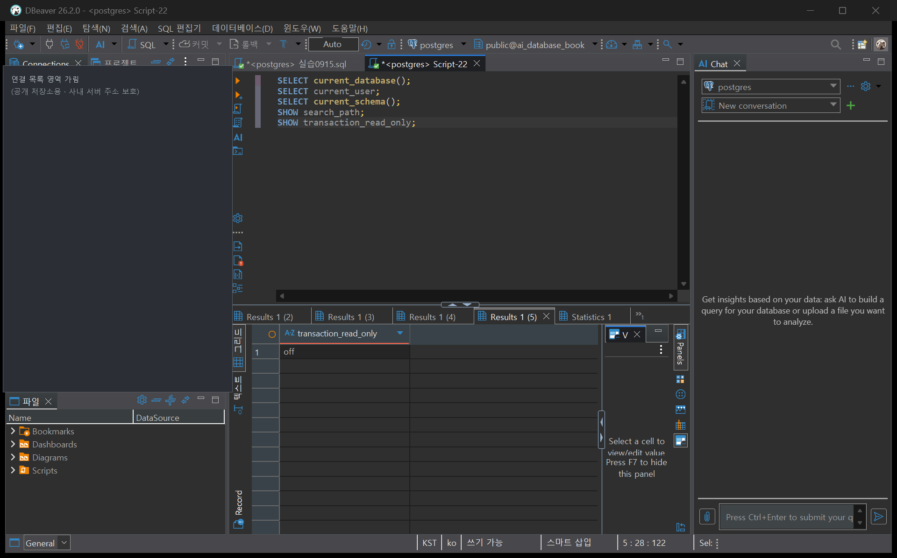
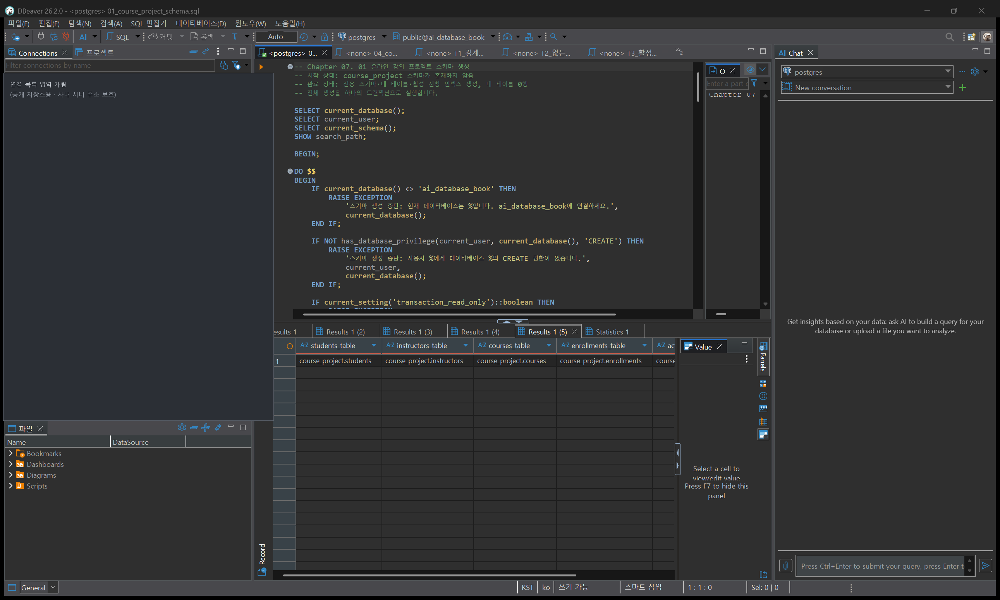
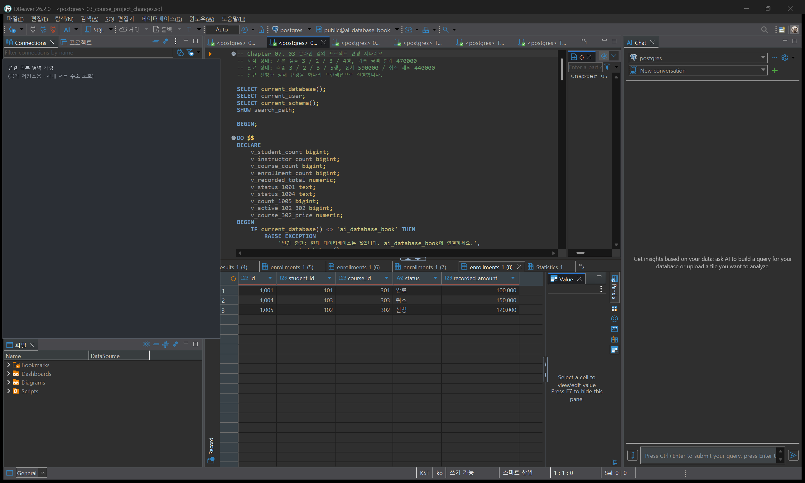
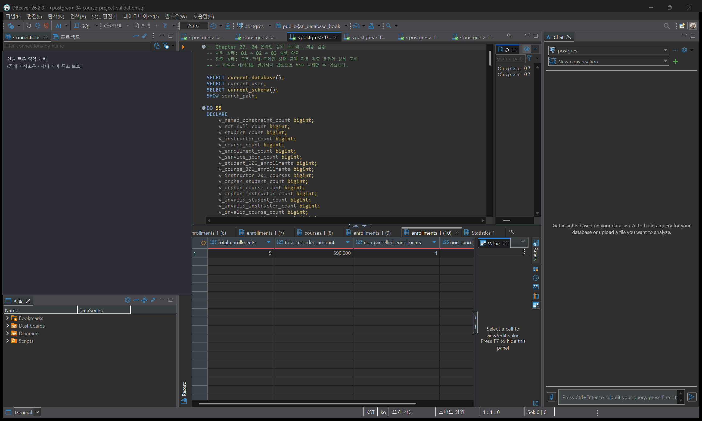
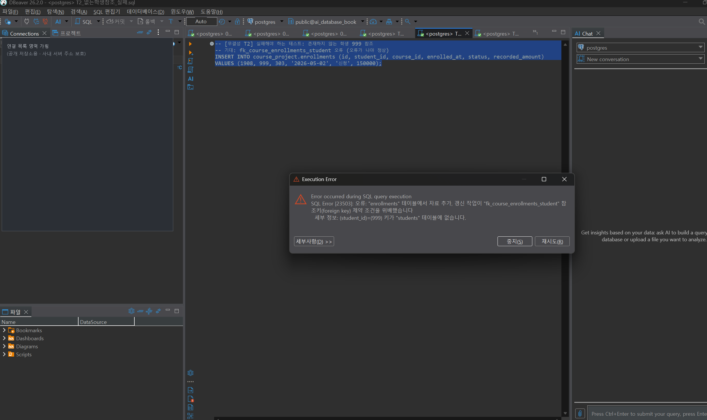
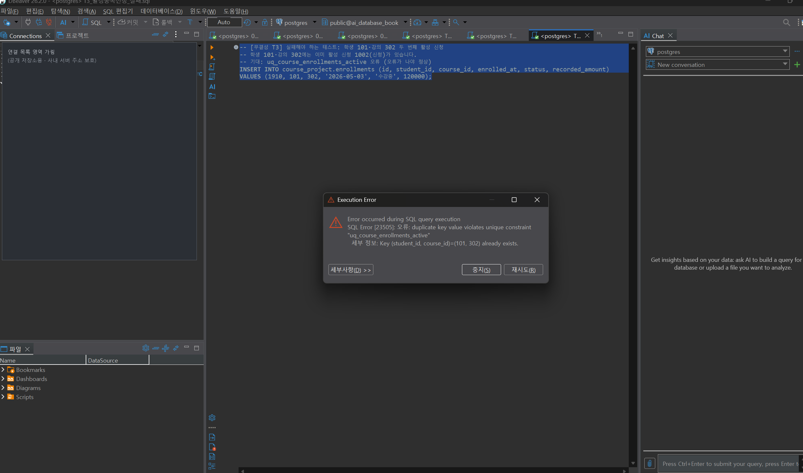
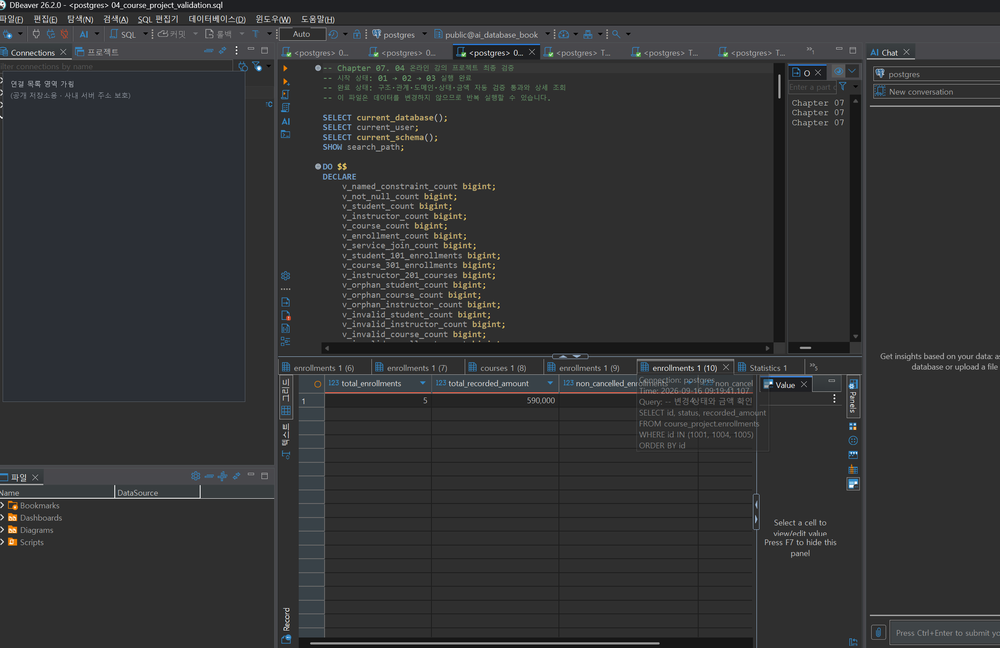
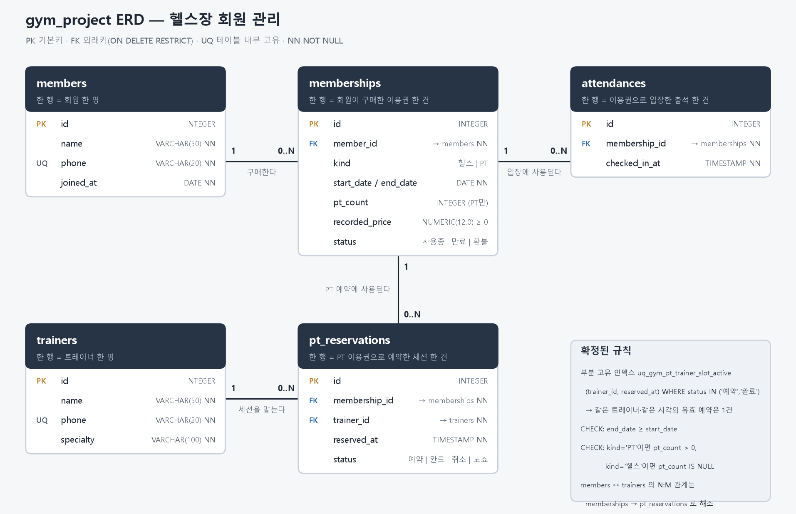
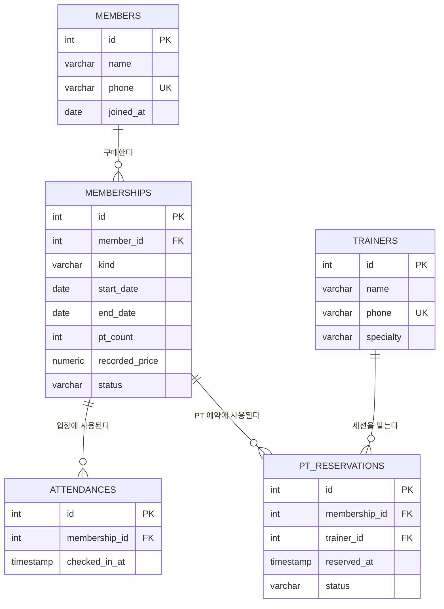

# Chapter 07 확장 실습 답안 템플릿

> **과제:** 실전 프로젝트 1 — 온라인 강의 수강신청 DB 완성하기  
> **사용 방법:** 이 파일을 내려받아 본인의 GitHub 저장소에 `chapter07_answer.md`라는 이름으로 저장한 뒤 실습하면서 바로 작성합니다.  
> **제출 방법:** LMS에는 파일을 직접 업로드하지 않고, **본인 GitHub 저장소의 `chapter07_answer.md` 파일 URL**을 제출합니다.

---

## 제출 전 주의

이 파일과 캡처 화면에는 실제 비밀번호, 전체 DB 접속 URL, API Key, 개인정보를 기록하지 않습니다.

```text
GitHub 계정 또는 별칭: apll970502
과제 작성일: 2026-09-16
사용한 AI 도구: Claude (Claude Code — SQL 실행 결과 정리, 답안 초안 작성, 설계 리뷰)
```

> 실행 환경: 로컬 PostgreSQL 18.4 / `ai_database_book` / `postgres` 역할.  
> SQL은 DBeaver(26.2.0)에서 `postgres` 연결 · `ai_database_book` DB로 실행했고, 증거 이미지는 그 DBeaver 실행 화면을 캡처한 것이다.  
> 샘플 데이터의 이름·이메일·전화번호는 모두 가상의 값이다.

---

# 1. 시작 환경 확인

다음을 실행합니다.

```sql
SELECT current_database();
SELECT current_user;
SELECT current_schema();
SHOW search_path;
SHOW transaction_read_only;
```

| 확인 항목 | 실제 결과 | 의미 |
| --- | --- | --- |
| `current_database()` | `ai_database_book` | 교재 실습용 DB에 연결되어 있다. 01~04 파일이 요구하는 DB와 같다. |
| `current_user` | `postgres` | 스키마를 생성할 역할이다. 01에서 만든 역할과 같은 역할로 02~05·reset을 실행해야 한다. |
| `current_schema()` | `public` | 이름을 생략한 객체는 `public`에 만들어진다. 프로젝트 SQL은 `course_project.` 스키마 한정 이름을 쓰므로 영향이 없다. |
| `search_path` | `"$user", public` | 스키마를 찾는 순서. `postgres` 스키마가 없으므로 사실상 `public`만 찾는다. |
| `transaction_read_only` | `off` | 쓰기 가능한 연결이다. `on`이면 01의 사전 검사에서 중단된다. |

- [x] 현재 DB가 `ai_database_book`이다.
- [x] 쓰기 가능한 연결인지 확인했다.
- [x] 실행할 SQL 범위를 확인했다.
- [x] Auto-commit 상태를 확인했다. (DBeaver `Development` 연결 유형 Auto-commit 켜짐, `psql` 기본 자동 커밋. 01~03은 파일 안에서 `BEGIN … COMMIT`으로 직접 묶는다.)

추가 확인: 실행 전 `to_regnamespace('course_project')` 결과가 `NULL`이어서, 초기화 없이 01부터 시작할 수 있는 상태였다.



### 프로젝트 SQL을 실행하기 전에 시작 상태를 확인해야 하는 이유

```text
SQL 파일은 "어떤 시작 상태에서 실행한다"는 전제를 가지고 작성되어 있다.
01은 course_project가 없을 때, 02는 네 테이블이 비어 있을 때, 03은 기본 샘플 상태일 때만 의도대로 동작한다.

다른 DB(postgres, ax_evaluation 등)에 연결된 채 실행하면 엉뚱한 곳에 스키마가 생기고,
이미 데이터가 있는 상태에서 02를 실행하면 PK 중복으로 실패하거나 기준 숫자가 어긋난다.
읽기 전용 연결이면 중간에 실패한다.

그래서 DB·사용자·search_path·읽기 전용 여부를 먼저 보고,
실행 결과가 틀렸을 때 "SQL이 틀린 것인지, 시작 상태가 틀린 것인지"를 구분할 수 있게 한다.
```

---

# 2. 프로젝트 범위와 요구사항 읽기

## 2-1. 포함 범위

본문을 그대로 복사하지 말고 자신의 말로 정리합니다.

```text
1. 학생과 강사를 각각 따로 관리한다. (이름·이메일, 학생은 가입일, 강사는 전문 분야)
2. 강의를 관리하고, 강의마다 담당 강사 한 명과 현재 기준 가격을 둔다.
3. 학생이 강의에 수강 신청한 사건을 한 건씩 저장하고 신청일과 상태(신청·수강중·완료·취소)를 기록한다.
4. 신청이 만들어질 때의 금액을 신청 행에 따로 남겨, 나중에 강의 가격이 바뀌어도 당시 금액을 볼 수 있게 한다.
```

## 2-2. 제외 범위

```text
1. 실제 결제 승인·실패·환불 거래 (payments, refunds 같은 구조가 없다)
2. 강의 정원과 대기열, 동시에 몰리는 신청 제어
3. 신청 상태가 바뀐 전체 이력 (현재 상태만 저장한다)
4. 강의 콘텐츠·학습 진도·수료, 수강평·쿠폰·할인
```

### 범위를 명확하게 정해야 하는 이유

```text
범위가 곧 테이블과 규칙의 경계이기 때문이다.
결제를 포함한다고 생각하면 recorded_amount를 "결제액"으로 오해하게 되고,
정원을 포함한다고 생각하면 동시 신청 제어까지 설계해야 한다.

제외 범위를 적어 두면 "왜 환불 테이블이 없느냐"는 질문에
"빠뜨린 것이 아니라 이번 버전에서 뺀 것"이라고 근거를 댈 수 있고,
AI가 결제·이력 테이블을 제안해도 범위 밖이라고 판단할 기준이 생긴다.
또 완료 기준(04 validation)을 정확히 정의할 수 있다. 범위가 흔들리면 완료 판단도 흔들린다.
```

## 2-3. 요구사항 / 프로젝트 결정 / 미확정 질문 구분

아래 항목 중 대표 항목을 정리합니다.

| ID | 종류 | 내용 요약 | DB 구조/규칙에 미치는 영향 |
| --- | --- | --- | --- |
| P07-R01 | 요구사항 | 학생은 이름·이메일·가입일을 가진다 | `students` 테이블과 `name`·`email`·`joined_at` NOT NULL 열 |
| P07-R05 | 요구사항 | 신청은 학생·강의·신청일·상태·신청 시 기록 금액을 가진다 | `enrollments`가 두 FK와 `enrolled_at`·`status`·`recorded_amount`를 가지는 사건 테이블이 된다 |
| P07-R07 | 요구사항 | 학생·강사 이메일은 각 테이블 안에서 공백·중복 불가 | 테이블별 `UNIQUE(email)`과 `CHECK(char_length(trim(email)) > 0)` |
| P07-D02 | 프로젝트 결정 | 신청 생성 시 그 시점의 `courses.price`를 `recorded_amount`에 복사·보존 | 신규 신청은 `INSERT … SELECT c.price`로 만들고, 가격이 바뀌어도 과거 행은 갱신하지 않는다 (CHECK로 강제하지 않음) |
| P07-D03 | 프로젝트 결정 | 같은 학생·강의의 진행 중(신청·수강중) 신청은 최대 1건 | 부분 고유 인덱스 `uq_course_enrollments_active … WHERE status IN ('신청','수강중')` |
| P07-Q01 | 미확정 질문 | 학생과 강사 사이에서도 이메일을 전역 고유하게 막아야 하는가 | 확정 전이므로 테이블별 UNIQUE만 두고, 통합 `users` 모델이나 교차 테이블 제약은 만들지 않는다 |

### 미확정 질문을 바로 제약조건으로 만들면 안 되는 이유

```text
제약조건은 "이런 데이터는 존재할 수 없다"는 확정 선언이다.
정책이 정해지지 않았는데 제약조건으로 만들면, 실제로는 허용해야 할 데이터를 DB가 거부하게 된다.

예를 들어 P07-Q01을 전역 UNIQUE로 확정하면
같은 사람이 학생이면서 강사로도 활동하는 경우를 등록할 수 없다.
나중에 허용하기로 결정하면 제약을 지우고 이미 거부된 업무를 복구해야 한다.

미확정 질문으로 남겨 두면 현재 구현(테이블별 UNIQUE)과 확정 시 검토할 구조가 문서로 분리되어,
결정이 나온 뒤 근거를 가지고 한 번에 반영할 수 있다.
```

---

# 3. 네 테이블의 한 행 의미와 관계

## 3-1. 한 행 의미

```text
course_project.students 한 행 =
  학생 한 명. 이름·이메일·가입일을 가진 수강 주체이다.

course_project.instructors 한 행 =
  강사 한 명. 이름·이메일·전문 분야를 가진다.

course_project.courses 한 행 =
  개설된 강의 한 개. 담당 강사 한 명, 제목·설명·난이도·현재 기준 가격·개설일을 가진다.

course_project.enrollments 한 행 =
  특정 학생이 특정 강의에 수강 신청한 사건 한 건.
  신청일·현재 상태·신청 시점에 기록한 금액을 함께 가진다.
```

## 3-2. 키와 중요 규칙

| 테이블 | PK | FK | 중요 규칙 |
| --- | --- | --- | --- |
| students | `id` (IDENTITY) | 없음 | `name`·`email`·`joined_at` NOT NULL, `uq_course_students_email`, 이름·이메일 공백 금지 CHECK |
| instructors | `id` (IDENTITY) | 없음 | `name`·`email`·`specialty` NOT NULL, `uq_course_instructors_email`, 이름·이메일·전문 분야 공백 금지 CHECK |
| courses | `id` (IDENTITY) | `instructor_id` → `instructors.id` (`ON DELETE RESTRICT`) | `description`만 NULL 허용, `level IN ('basic','intermediate','advanced')`, `price >= 0`, 제목 공백 금지 |
| enrollments | `id` (IDENTITY) | `student_id` → `students.id`, `course_id` → `courses.id` (둘 다 `RESTRICT`) | `status IN ('신청','수강중','완료','취소')`, `recorded_amount >= 0`, 부분 고유 인덱스 `uq_course_enrollments_active` |

실제 확인한 명명 제약조건은 15개(UNIQUE 2, CHECK 10, FK 3)이고, NOT NULL 열은 students 4 + instructors 4 + courses 6 + enrollments 6 = 20개다.

## 3-3. 관계를 양방향 문장으로 작성

```text
instructors ↔ courses:
  강사 한 명은 강의를 0개 이상 담당할 수 있다.
  강의 한 개는 반드시 강사 한 명에게 속한다. (1 : 0..N, courses.instructor_id NOT NULL)

students ↔ enrollments:
  학생 한 명은 수강 신청을 0건 이상 할 수 있다. (학생 101은 2건)
  신청 한 건은 반드시 학생 한 명의 신청이다. (1 : 0..N)

courses ↔ enrollments:
  강의 한 개는 신청을 0건 이상 받을 수 있다. (강의 301은 2건)
  신청 한 건은 반드시 강의 한 개에 대한 신청이다. (1 : 0..N)
```

### 학생과 강의의 N:M 관계가 `enrollments`를 통해 어떻게 바뀌는지 설명

```text
업무 문장으로 보면 "학생 한 명은 여러 강의를 듣고, 강의 하나는 여러 학생이 듣는다"는 N:M 관계다.
하지만 관계형 테이블의 한 칸에는 값 하나만 넣을 수 있으므로
students에 course_id를 넣거나 courses에 student_id를 넣는 방식으로는 표현할 수 없다.

그래서 신청 한 건을 행으로 갖는 enrollments를 가운데 두고
students 1 : N enrollments N : 1 courses 두 개의 1:N 관계로 나눈다.
실제 데이터에서 학생 101은 강의 301·302에, 강의 301은 학생 101·102에 연결되어
두 방향의 "여러 개"가 모두 enrollments의 행으로 표현되었다.
```

### `enrollments`가 단순 연결 테이블이 아니라 사건 테이블이라고 볼 수 있는 이유

```text
단순 연결 테이블이라면 (student_id, course_id) 쌍만 있으면 되고 같은 쌍은 한 번만 존재한다.
enrollments는 그렇지 않다.

1. 신청 자체의 속성이 있다. enrolled_at(언제), status(지금 어떤 단계), recorded_amount(그때 얼마)는
   학생이나 강의의 속성이 아니라 "그 신청 한 건"의 속성이다.
2. 같은 학생·강의 쌍이 시간을 두고 여러 번 생길 수 있다.
   완료·취소 행은 보존하고 새 신청을 만들 수 있게 PK를 별도 id로 두고,
   중복 차단도 전체가 아니라 진행 중 상태에만 건다. (선택 테스트에서 1001 완료 뒤 101·301 재신청이 성공함)
3. 상태가 변한다. 1001은 수강중 → 완료, 1004는 신청 → 취소로 바뀌었다.

즉 "누가 무엇을 들었다"는 연결 사실이 아니라 "언제 어떤 조건으로 신청했고 지금 어떤 상태인가"를 기록하는 사건 엔터티다.
```

---

# 4. `recorded_amount`의 의미 이해

```text
courses.price =
  지금 이 강의에 매겨진 기준 가격. 가격 정책이 바뀌면 이 값이 수정된다.

enrollments.recorded_amount =
  신청이 만들어진 시점에 그 신청 행에 기록해 둔 금액.
  현재 범위에는 할인·쿠폰이 없으므로 신청 생성 SQL이 그 시점의 courses.price를 복사한다.
```

### 두 값이 처음에는 같아도 같은 의미가 아닌 이유

```text
두 값은 바뀌는 시점이 다르다.
courses.price는 "현재"를 표현하므로 가격이 오르면 갱신되지만,
recorded_amount는 "신청 당시"를 표현하므로 이후 가격 변경과 무관하게 그대로 남아야 한다.

예를 들어 강의 302의 가격이 나중에 150000으로 오르더라도
1005(신청 당시 120000)의 recorded_amount는 120000으로 유지되어야 한다.
만약 신청 행에 금액을 두지 않고 매번 courses.price를 JOIN해 계산하면
과거 신청의 금액이 현재 가격으로 바뀌어 보이는 오류가 생긴다.

그래서 03에서도 1005를 만들 때 값을 직접 쓰지 않고 INSERT … SELECT c.price 로 복사했고,
이 복사는 CHECK가 아니라 신청 생성 SQL의 책임이다.
```

### `recorded_amount`를 실제 결제 성공액이나 회계 매출로 해석하면 안 되는 이유

```text
현재 프로젝트에는 결제 승인·실패·환불을 기록하는 구조가 없다.
recorded_amount는 "신청할 때 기록한 금액"일 뿐, 돈이 실제로 결제됐는지는 알 수 없다.

실제로 1004는 취소 상태인데 recorded_amount는 150000 그대로 남아 있다.
취소 시 0으로 바꾸지 않은 이유는 신청 기록과 환불 거래의 의미를 섞지 않기 위해서다.
따라서 전체 합계 590000이나 취소 제외 합계 440000은 "기록 금액의 합계"이지
매출·결제액·환불 후 순수 금액이 아니다.
매출로 부르려면 결제·환불 테이블이 범위에 들어온 뒤 그 거래 기준으로 다시 집계해야 한다.
```

---

# 5. STEP 01 — 스키마와 테이블 생성

실행 파일:

```text
code/chapter07/01_course_project_schema.sql
```

## 5-1. 실행 전 예상

```text
course_project 스키마 존재 여부: 실행 전 없음 → 실행 후 생성
예상 테이블 수: 4 (students, instructors, courses, enrollments)
예상 데이터 행 수: 네 테이블 모두 0행
예상되는 명명 제약조건 수: 15 (UNIQUE 2 + CHECK 10 + FK 3)
예상되는 NOT NULL 열 수: 20 (students 4 / instructors 4 / courses 6 / enrollments 6)
부분 고유 인덱스 존재 여부: uq_course_enrollments_active 생성
```

## 5-2. 실행 결과

```text
실제 테이블 수: 4
실제 명명 제약조건 수: 15
실제 NOT NULL 열 수: 20 (courses 6 / enrollments 6 / instructors 4 / students 4)
부분 고유 인덱스: course_project.uq_course_enrollments_active 존재
네 테이블의 실제 행 수: 0 / 0 / 0 / 0 (파일 내부 검증 블록이 0행을 확인한 뒤 통과)
통과 메시지: Chapter 07 course project schema creation passed
```

### 예상과 실제 비교

```text
예상과 모두 일치했다.
실행 로그는 BEGIN → DO(사전 검사) → CREATE SCHEMA → CREATE TABLE ×4 → CREATE INDEX → DO(사후 검증) → COMMIT 순서였다.

테이블은 부모 → 자식 순서(students, instructors → courses → enrollments)로 만들어진다.
FK가 참조할 테이블이 먼저 있어야 하기 때문이다.
사후 검증 블록이 15/20/0행 중 하나라도 어긋나면 RAISE EXCEPTION으로 COMMIT 전에 전체가 취소되므로,
통과 메시지가 나왔다는 것은 구조 기준을 모두 만족한 상태로 커밋되었다는 뜻이다.
```

### 증거 화면

권장 경로:

```text
assignments/chapter07/images/step05_schema.png
```



---

# 6. STEP 02 — Seed 데이터 입력

실행 파일:

```text
code/chapter07/02_course_project_seed.sql
```

## 6-1. 실행 전 예상

```text
students: 3 (101, 102, 103)
instructors: 2 (201, 202)
courses: 3 (301, 302, 303)
enrollments: 4 (1001~1004)
recorded_amount 합계: 100000 + 120000 + 100000 + 150000 = 470000
학생 101 신청 건수: 2 (1001, 1002)
강의 301 신청 건수: 2 (1001, 1003)
강사 201 담당 강의 수: 2 (301, 302)
활성 중복 신청: 0
```

## 6-2. 실제 결과

```text
students: 3
instructors: 2
courses: 3
enrollments: 4
recorded_amount 합계: 470000
학생 101 신청 건수: 2
강의 301 신청 건수: 2
강사 201 담당 강의 수: 2
활성 중복 신청: 0
1001 상태: 수강중
1004 상태: 신청
1005 존재 여부: 없음
통과 메시지: Chapter 07 course project seed passed
```

INSERT 결과는 `INSERT 0 3 / INSERT 0 2 / INSERT 0 3 / INSERT 0 4`였고, 마지막에 IDENTITY 시작값을 104 / 203 / 304 / 1005로 조정했다.

### Seed 데이터를 단순 예제가 아니라 검증 데이터라고 볼 수 있는 이유

```text
행 하나하나가 확인하려는 규칙을 가지고 들어가 있다.

- 학생 101이 301·302 두 강의를 신청 → 학생 1 : N 신청 관계 확인
- 강의 301을 학생 101·102가 신청 → 강의 1 : N 신청 관계, 즉 N:M이 enrollments로 풀렸는지 확인
- 강사 201이 301·302 담당 → 강사 1 : N 강의 확인
- 상태가 수강중·신청으로 섞여 있음 → 03에서 상태별 조건부 UPDATE를 검증할 재료
- 금액이 100000·120000·150000으로 달라 합계 470000 → 금액 누락·중복을 숫자로 검산
- 1005가 아직 없음 → 03의 신규 신청이 정확히 한 번 들어갔는지 판단하는 기준

그래서 02는 "화면을 채우는 예시"가 아니라 01의 구조가 요구사항대로 동작하는지,
03의 변경이 의도대로 되었는지를 숫자로 판정하기 위한 기준 상태다.
```

---

# 7. STEP 03 — 변경 시나리오 실행

실행 파일:

```text
code/chapter07/03_course_project_changes.sql
```

## 7-1. 실행 전에 상태 변화를 예상

| 신청 ID | 변경 전 예상 상태 | 변경 후 예상 상태 | 예상 recorded_amount |
| ---: | --- | --- | ---: |
| 1001 | 수강중 | 완료 | 100000 |
| 1004 | 신청 | 취소 | 150000 |
| 1005 | 없음 | 신청 (학생 102 → 강의 302) | 120000 |

```text
변경 후 예상 enrollments 행 수: 5
변경 후 예상 전체 recorded_amount 합계: 470000 + 120000 = 590000
변경 후 예상 취소 제외 건수: 4
변경 후 예상 취소 제외 recorded_amount 합계: 590000 − 150000(1004) = 440000
```

## 7-2. 실제 결과

```text
1001 상태 / recorded_amount: 완료 / 100000
1004 상태 / recorded_amount: 취소 / 150000
1005 상태 / recorded_amount: 신청 / 120000
최종 enrollments 행 수: 5
전체 recorded_amount 합계: 590000
취소 제외 건수: 4
취소 제외 recorded_amount 합계: 440000
활성 중복 신청: 0
통과 메시지: Chapter 07 course project changes passed
```

RETURNING으로 확인한 변경 결과는 `INSERT 0 1`(1005), `UPDATE 1`(1001), `UPDATE 1`(1004)였다. 세 문장 모두 정확히 한 행씩만 바뀌었다.

### 조건부 UPDATE에서 예상 이전 상태를 확인해야 하는 이유

```text
UPDATE … SET status='완료' WHERE id=1001 AND status='수강중' 에서
AND status='수강중'이 없으면 1001이 이미 취소되었거나 다른 사람이 먼저 바꿔 둔 상태여도
무조건 '완료'로 덮어쓰게 된다.

이전 상태를 조건에 넣으면, 내가 예상한 상태와 실제 데이터가 일치할 때만 변경되고
일치하지 않으면 0행이 바뀌어 이상을 발견할 수 있다.
03은 여기에 더해 파일 시작 부분에서 3/2/3/4행, 합계 470000, 1001=수강중, 1004=신청, 1005 없음,
강의 302 가격 120000을 먼저 검사하고, 끝에서 결과를 다시 검사한 뒤에만 COMMIT한다.
그래서 두 번 실행하거나 잘못된 시작 상태에서 실행해도 데이터가 부분적으로 바뀌지 않는다.
```

### 증거 화면

권장 경로:

```text
assignments/chapter07/images/step07_changes.png
```



---

# 8. STEP 04 — 최종 완료 게이트 실행

실행 파일:

```text
code/chapter07/04_course_project_validation.sql
```

## 8-1. 최종 검증 결과

```text
최종 행 수 students/instructors/courses/enrollments: 3 / 2 / 3 / 5
서비스 JOIN 결과 행 수: 5
학생 101 신청 수: 2
강의 301 신청 수: 2
강사 201 강의 수: 2
고아 관계 수: 0 (학생 참조 0 + 강의 참조 0 + 강사 참조 0)
활성 중복 신청 수: 0
전체 recorded_amount: 590000
취소 제외 recorded_amount: 440000 (4건)
통과 메시지: Chapter 07 course project validation passed
```

명명 제약조건 15개, NOT NULL 열 20개, 공백·허용값·금액 범위 오류 0건, 1001·1004·1005 상태와 금액 일치도 같은 검증 블록 안에서 함께 통과했다.

### SQL 파일 4개가 모두 실행되었다는 사실과 프로젝트 검증 PASS가 다른 이유

```text
"실행되었다"는 오류 없이 끝났다는 뜻일 뿐, 결과가 요구사항과 같다는 뜻이 아니다.
예를 들어 02를 실수로 두 번 넣었거나(다른 id로), 03의 조건이 틀려 0행이 바뀌었거나,
누군가 제약조건 하나를 지워도 SQL 파일은 오류 없이 끝날 수 있다.

04는 구조(제약조건 15·NOT NULL 20), 행 수(3/2/3/5), 관계(JOIN 5행, 101·301·201 기준),
무결성(고아 0, 공백·허용값·금액 오류 0, 활성 중복 0), 변경 결과(1001·1004·1005),
금액(590000·440000)을 숫자로 비교하고 하나라도 다르면 예외를 낸다.
따라서 PASS는 "완료 기준을 모두 만족하는 상태가 DB에 실제로 존재한다"는 증거이고,
데이터를 바꾸지 않는 파일이라 테스트 뒤나 다른 날에도 다시 실행해 같은 판정을 받을 수 있다.
```

### 증거 화면

권장 경로:

```text
assignments/chapter07/images/step08_validation.png
```



---

# 9. 무결성 테스트

실행 파일:

```text
code/chapter07/05_course_project_integrity_tests.sql
```

> 오류 테스트는 파일 전체를 무작정 실행하지 않고 **한 테스트 구간씩** 실행합니다.

각 구간을 자동 커밋 문장 하나씩 따로 실행했다. 대표 3개 외에 오류 3(없는 강사 참조), 오류 6(허용되지 않은 상태 `대기`), 선택 성공 B(완료 이력 뒤 재신청)도 실행해 모두 기대대로 나왔다.

## 9-1. 허용되어야 하는 경계값 1개

```text
테스트 내용:
  경계 테스트 A. 강사 202의 무료 강의 1801(price=0, description=NULL)을 만들고,
  학생 103이 그 강의에 recorded_amount=0으로 신청(1802)한 뒤 두 행을 삭제했다.
기대 결과: 두 INSERT 모두 성공
실제 결과:
  INSERT 0 1 / INSERT 0 1 성공. 조회 결과 price=0, description_is_null=t, recorded_amount=0.
  이후 DELETE 1 / DELETE 1 로 임시 행을 지웠고, 잔존 행 0건을 확인했다.
왜 허용되어야 하는가:
  P07-D01에 따라 무료는 0이라는 확정 금액으로 표현한다. CHECK는 price >= 0 이므로 0은 경계 안이다.
  0을 막으면 무료 강의를 NULL로 넣어야 하는데, NULL은 "금액을 모름"과 구분되지 않는다.
  description은 요구사항(P07-R03)에서 선택 항목이므로 NULL이 허용되어야 한다.
```

## 9-2. 실패해야 하는 테스트 1 — 잘못된 참조 또는 값

```text
테스트 내용:
  오류 8. 존재하지 않는 학생 999가 강의 303에 신청
  INSERT INTO course_project.enrollments (id,student_id,course_id,enrolled_at,status,recorded_amount)
  VALUES (1908,999,303,'2026-05-02','신청',150000);
기대 결과: 실패, 행이 추가되지 않음
실제 오류 핵심:
  오류: "enrollments" 테이블에서 자료 추가, 갱신 작업이 "fk_course_enrollments_student"
        참조키(foreign key) 제약 조건을 위배했습니다
  DETAIL: (student_id)=(999) 키가 "students" 테이블에 없습니다.
동작한 제약조건/규칙: fk_course_enrollments_student (P07-R09)
왜 실패해야 하는가:
  누가 신청했는지 알 수 없는 신청은 JOIN하면 사라지고, 학생별 집계에서도 빠지는 고아 행이 된다.
  "존재하는 학생·강의만 참조한다"는 요구사항을 DB가 입력 시점에 막아야
  04의 고아 관계 0건 기준이 계속 유지된다.
  (같은 방식으로 오류 3 없는 강사 999 참조는 fk_course_courses_instructor에서,
   오류 6 상태 '대기'는 chk_course_enrollments_status에서 실패했다.)
```

## 9-3. 실패해야 하는 테스트 2 — 활성 중복 신청

```text
테스트 내용:
  오류 10. 학생 101은 강의 302에 이미 활성 신청 1002(신청)가 있는데, 같은 강의에 두 번째 신청을 넣음
  INSERT INTO course_project.enrollments (id,student_id,course_id,enrolled_at,status,recorded_amount)
  VALUES (1910,101,302,'2026-05-03','수강중',120000);
기대 결과: 실패
실제 오류 핵심:
  오류: 중복된 키 값이 "uq_course_enrollments_active" 고유 제약 조건을 위반함
  DETAIL: (student_id, course_id)=(101, 302) 키가 이미 있습니다.
동작한 인덱스/규칙: 부분 고유 인덱스 uq_course_enrollments_active (P07-D03)
왜 실패해야 하는가:
  같은 학생이 같은 강의에 진행 중 신청을 두 건 가지면 수강 인원·금액이 두 번 세어지고,
  어느 행이 진짜 신청인지 알 수 없다.
  반면 인덱스 조건이 status IN ('신청','수강중')이라 완료·취소 이력은 막지 않는다.
  실제로 1001(완료) 뒤 학생 101·강의 301의 새 신청(1805)은 성공했다.
  전체 UNIQUE(student_id, course_id)였다면 이 재신청까지 막혔을 것이다.
```

## 9-4. 실패 후 기준 상태 재검증

```text
04 validation 재실행 결과: Chapter 07 course project validation passed
기준 데이터가 유지되었는가:
  유지되었다. 05 파일의 기준 상태 블록도 "Chapter 07 core integrity test baseline preserved"를 출력했다.
  3/2/3/5행, 590000/440000, 1001 완료·1004 취소·1005 신청, 활성 중복 0이 그대로였고
  임시 행(1801·1802·1805·1903·1906·1908·1910) 잔존 0건을 확인했다.
  오류 11(참조 중인 학생 101 삭제)도 RESTRICT로 실패해 학생·신청이 모두 남아 있었다.
```

### 실패 테스트가 프로젝트 품질 검증에 필요한 이유

```text
정상 데이터만 넣어 보면 "규칙이 있어서 통과한 것"과 "규칙이 없어도 통과했을 것"을 구분할 수 없다.
잘못된 데이터를 일부러 넣었을 때 정확히 예상한 제약조건 이름으로 거부되는 것을 봐야
그 규칙이 실제로 DB에 존재하고 동작한다고 말할 수 있다.

또 실패 테스트 뒤 04를 다시 실행해 기준 상태가 그대로인지 확인해야
"테스트가 데이터를 오염시키지 않았다"는 것까지 보장된다.
성공 경계(0원, NULL 설명, 완료 뒤 재신청)를 함께 보면 규칙이 너무 강해 정상 업무까지 막지 않는지도 확인할 수 있다.
```

### 증거 화면

권장 경로:

```text
assignments/chapter07/images/step09_integrity_fk.png
assignments/chapter07/images/step09_integrity.png
assignments/chapter07/images/step09_revalidation.png
```







> 마지막 화면은 실패 테스트를 모두 실행한 뒤 `04_course_project_validation.sql`을 다시 실행한 결과로, 기준 상태(5행 / 590,000 / 취소 제외 4건)가 그대로 유지되었음을 보여준다.

---

# 10. 재현성 실험

> 이 단계는 본인의 실습 환경이며 보존할 데이터가 없을 때만 수행합니다.

실행 순서:

```text
reset_course_project.sql
→ 01_course_project_schema.sql
→ 02_course_project_seed.sql
→ 03_course_project_changes.sql
→ 04_course_project_validation.sql
```

```text
처음 실행의 최종 결과:
  04 PASS. 테이블 4 / 명명 제약조건 15 / NOT NULL 20 / 부분 고유 인덱스 있음,
  3/2/3/5행, JOIN 5행, 101·301·201 = 2/2/2, 고아 0, 활성 중복 0, 590000 / 440000
재실행의 최종 결과:
  reset "Chapter 07 course project reset passed" → 01·02·03 각 passed → 04 PASS.
  구조·행 수·관계·금액 기준값을 같은 조회로 다시 뽑아 비교한 결과 처음과 완전히 동일
두 결과가 일치했는가: 일치했다
중간에 수동 수정이 필요했는가: 필요 없었다. 다섯 파일 모두 종료 코드 0으로 끝났다.
```

### 다른 사람이 같은 순서로 실행해 같은 결과를 얻는 것이 중요한 이유

```text
DB 프로젝트의 결과물은 파일이 아니라 "파일을 실행해서 만들어지는 상태"이기 때문이다.
내 PC에서만 손으로 고쳐 가며 맞춘 상태라면 팀원·채점자·Chapter 08의 나 자신이 같은 상태를 만들 수 없고,
04 PASS도 증명할 수 없다.

같은 순서로 실행해 같은 숫자가 나오면 결과가 SQL 파일에 완전히 기록되어 있다는 뜻이고,
문제가 생겼을 때 reset 후 다시 만들어 원인을 좁힐 수 있다.
Chapter 08도 590000·440000 기준을 전제로 시작하므로 재현성이 곧 다음 단계의 출발점이다.
```

---

# 11. Chapter 01~06 개인 프로젝트를 중간 프로젝트 초안으로 확장

온라인 강의 예제를 이름만 바꾸지 않고 본인의 아이디어를 사용합니다.

Chapter 01 답안 6번에서 정한 **헬스장 회원 관리 시스템**(회원 · 트레이너 · 이용권 · PT 예약 · 출석)을 이어서 확장했다.

## 11-1. 프로젝트 기본 정보

```text
프로젝트 이름: 헬스장 회원 관리 시스템 (스키마 후보: gym_project)

해결하려는 문제:
  이 프로젝트는 회원이 어떤 이용권을 언제 얼마에 구매했고,
  그 이용권으로 언제 출석하고 어떤 트레이너에게 PT를 예약·이용했는지를
  한곳에서 정확하게 추적하지 못하는 문제를 해결하기 위한 데이터베이스이다.
  (종이 출석부·메신저 예약으로 관리하면 같은 시간 PT 중복 예약, 이용권 기간 착오,
   환불·취소 기록 유실이 생긴다.)

주요 사용자:
  헬스장 데스크 직원(회원·이용권 등록, 출석 확인), 트레이너(PT 일정 확인),
  운영자(이용권·출석 현황 조회)
```

## 11-2. 포함 범위 / 제외 범위

```text
[포함]
1. 회원과 트레이너의 기본 정보 관리
2. 회원이 구매한 이용권(헬스 기간권 / PT 횟수권)과 구매 당시 기록 가격·기간·상태
3. 이용권으로 입장한 출석 기록
4. PT 이용권으로 트레이너에게 예약한 세션과 예약 상태(예약·완료·취소·노쇼)

[제외]
1. 실제 결제 승인·환불 금액 거래 (recorded_price는 구매 당시 기록 가격일 뿐 결제액이 아님)
2. 락커·운동복 대여, 그룹 수업(GX) 정원과 대기열
3. 트레이너 급여·정산, 회원 운동 기록(루틴·체성분)
```

## 11-3. 요구사항

최소 8개를 작성합니다.

| ID | 요구사항 | 관련 테이블/관계 | 검증 방법 후보 |
| --- | --- | --- | --- |
| P07-MR01 | 회원은 이름·전화번호·가입일을 가진다 | `members` | 필수값 NULL·이름 공백 INSERT 실패 |
| P07-MR02 | 트레이너는 이름·전화번호·전문 분야를 가진다 | `trainers` | 필수값 NULL INSERT 실패 |
| P07-MR03 | 전화번호는 회원 테이블 안에서, 트레이너 테이블 안에서 각각 중복될 수 없다 | `members.phone`, `trainers.phone` UNIQUE | 같은 전화번호 두 번째 INSERT 실패 |
| P07-MR04 | 이용권은 정확히 한 회원의 것이며 종류(헬스·PT)·시작일·종료일·구매 당시 기록 가격·상태(사용중·만료·환불)를 가진다 | `members 1:N memberships` | 없는 회원 999 참조 실패, 잘못된 종류·상태 실패 |
| P07-MR05 | 이용권의 종료일은 시작일보다 빠를 수 없다 | `memberships` CHECK | 종료일 < 시작일 INSERT 실패 |
| P07-MR06 | PT 이용권은 1회 이상의 PT 횟수를 가지고, 헬스 이용권은 PT 횟수를 가지지 않는다 | `memberships` CHECK | 헬스 이용권에 `pt_count=10` INSERT 실패 |
| P07-MR07 | 이용권 기록 가격은 NULL일 수 없고 0 이상이다 (이벤트 무료권은 0) | `memberships.recorded_price` | 0원 성공, 음수 실패 |
| P07-MR08 | 출석은 어떤 이용권으로 언제 입장했는지를 한 건씩 기록한다 | `memberships 1:N attendances` | 출석 행 수·고아 출석 0건 조회 |
| P07-MR09 | PT 예약은 한 PT 이용권·한 트레이너·예약 시각·상태(예약·완료·취소·노쇼)를 가진다 | `memberships 1:N pt_reservations`, `trainers 1:N pt_reservations` | 없는 트레이너 참조 실패, 상태 `대기` 실패 |
| P07-MR10 | 같은 트레이너의 같은 시각에는 유효 예약(예약·완료)이 한 건만 있을 수 있다 | `pt_reservations` 부분 고유 인덱스 | 두 번째 유효 예약 실패, 취소 행과 같은 시각은 성공 |
| P07-MR11 | 존재하는 회원·트레이너·이용권만 참조하고, 이력이 있는 부모는 삭제할 수 없다 | 모든 FK `ON DELETE RESTRICT` | 이용권이 있는 회원 삭제 실패, 고아 0건 |

## 11-4. 프로젝트 결정

최소 3개를 작성합니다.

| ID | 이번 프로젝트에서 내린 결정 | 이유 | 구현 후보 |
| --- | --- | --- | --- |
| P07-MD01 | 이용권 구매 시 그 시점의 가격표 금액을 `memberships.recorded_price`에 복사해 보존한다 | 가격표가 오르거나 이벤트가 끝나도 과거 구매 금액이 바뀌면 안 된다. Chapter 07의 `recorded_amount`와 같은 원리 | `NUMERIC(12,0) NOT NULL CHECK (>= 0)`, 구매 생성 SQL에서 복사 |
| P07-MD02 | 취소·노쇼 예약은 삭제하지 않고 상태로 남기며, 중복 차단은 유효 예약(예약·완료)에만 건다 | 노쇼 이력이 정책(P07-MQ01) 판단 근거가 되고, 취소된 시간은 다시 예약할 수 있어야 한다 | 부분 고유 인덱스 `(trainer_id, reserved_at) WHERE status IN ('예약','완료')` |
| P07-MD03 | 출석과 PT 예약은 `member_id`가 아니라 `membership_id`를 참조한다 | "어떤 이용권으로 이용했는가"가 필요하고, 회원은 이용권을 통해 도출된다. 두 FK를 같이 두면 서로 다른 회원을 가리키는 불일치가 생길 수 있다 | `attendances.membership_id`, `pt_reservations.membership_id` FK |
| P07-MD04 | 이력이 있는 회원·트레이너·이용권은 삭제를 제한하고, 환불도 행 삭제가 아니라 `status='환불'`로 표현한다 | 출석·예약 이력이 함께 사라지는 것을 막는다. 탈퇴 처리 방식은 미확정(P07-MQ03) | 모든 FK `ON DELETE RESTRICT`, 상태 CHECK |

## 11-5. 미확정 질문

최소 3개를 작성합니다.

```text
P07-MQ01. PT 예약에 노쇼하면 PT 잔여 횟수를 차감하는가? 차감한다면 몇 분 전 취소까지 차감하지 않는가?
          (현재: 노쇼를 상태로만 기록하고 잔여 횟수 계산 규칙·트리거는 만들지 않음)
P07-MQ02. 이용권을 환불하면 이미 쌓인 출석·PT 기록을 보존하는가? 환불 금액을 따로 기록해야 하는가?
          (현재: status='환불'만 두고 기록은 삭제하지 않음. 환불 금액 구조는 범위 밖)
P07-MQ03. 탈퇴 회원의 이름·전화번호를 얼마 동안 보관하고, 이후 삭제·익명화하는가?
          탈퇴한 회원의 전화번호를 새 회원이 쓸 수 있는가?
          (현재: 부모 삭제 제한 + 테이블 내부 UNIQUE만 적용)
P07-MQ04. 같은 날 여러 번 입장하면 출석을 각각 인정하는가, 하루 1회로만 인정하는가?
          (현재: 입장 시각마다 한 행. 하루 1회 UNIQUE는 만들지 않음)
P07-MQ05. 한 회원이 기간이 겹치는 헬스 이용권을 동시에 가질 수 있는가? (연장 결제 선구매 등)
```

---

# 12. 개인 프로젝트 ERD와 한 행 의미

## 12-1. 테이블 후보

최소 4개를 권장합니다.

| 테이블 | 한 행의 의미 | PK 후보 | FK 후보 | 주요 규칙 |
| --- | --- | --- | --- | --- |
| `members` | 회원 한 명 | `id` | 없음 | `name`·`phone`·`joined_at` NOT NULL, `uq_gym_members_phone`, 이름 공백 금지 |
| `trainers` | 트레이너 한 명 | `id` | 없음 | `name`·`phone`·`specialty` NOT NULL, `uq_gym_trainers_phone` |
| `memberships` | 회원이 구매한 이용권 한 건 | `id` | `member_id` → `members.id` | `kind IN ('헬스','PT')`, `end_date >= start_date`, PT면 `pt_count > 0`·헬스면 `pt_count IS NULL`, `recorded_price >= 0`, `status IN ('사용중','만료','환불')` |
| `attendances` | 이용권으로 입장한 출석 한 건 | `id` | `membership_id` → `memberships.id` | `checked_in_at` NOT NULL |
| `pt_reservations` | PT 이용권으로 트레이너에게 예약한 세션 한 건 | `id` | `membership_id` → `memberships.id`, `trainer_id` → `trainers.id` | `status IN ('예약','완료','취소','노쇼')`, 부분 고유 인덱스 `uq_gym_pt_trainer_slot_active` |

독립 관리 대상은 `members`·`trainers`, 사건 테이블은 `memberships`(구매)·`attendances`(입장)·`pt_reservations`(예약)이다.

## 12-2. 관계 문장

```text
1. members ↔ memberships
   회원 한 명은 이용권을 0건 이상 구매할 수 있다.
   이용권 한 건은 반드시 회원 한 명의 것이다. (1 : 0..N)

2. memberships ↔ attendances
   이용권 한 건은 출석에 0번 이상 사용될 수 있다.
   출석 한 건은 반드시 이용권 한 건으로 입장한 기록이다. (1 : 0..N)

3. memberships ↔ pt_reservations ↔ trainers
   PT 이용권 한 건은 PT 예약을 0건 이상 가질 수 있고, 트레이너 한 명은 PT 예약을 0건 이상 맡는다.
   PT 예약 한 건은 반드시 이용권 한 건과 트레이너 한 명에 속한다.
   → "회원 여러 명이 트레이너 여러 명에게 PT를 받는다"는 N:M 관계를
     pt_reservations 사건 엔터티(예약 시각·상태를 가짐)로 해소했다.
```

## 12-3. ERD

권장 이미지 경로:

```text
assignments/chapter07/images/personal_project_erd.png
```





### Chapter 05~06 ERD에서 이번에 바꾼 점

```text
Chapter 05는 과제가 없어 개인 서비스 ERD를 따로 만들지 않았으므로,
Chapter 01 답안 6번의 초안(회원·트레이너·이용권·PT 예약·출석 5개 후보)과 비교했다.

1. PT 예약: 초안은 "회원과 트레이너 사이의 데이터"였는데,
   PT 횟수가 이용권에 속하므로 member_id 대신 membership_id를 참조하도록 바꿨다. (P07-MD03)
2. 출석: 초안에서는 한 행 의미가 정해지지 않았는데, "이용권으로 입장한 한 건"으로 확정했다.
3. 이용권: 종류(헬스·PT)를 한 테이블에 두고, PT 횟수·기간·구매 당시 가격·상태 열과
   종류별 CHECK를 추가했다. 구매 당시 가격은 Chapter 07의 recorded_amount 원리를 적용했다. (P07-MD01)
4. 취소·노쇼를 삭제하지 않고 상태로 남기고, 같은 트레이너·시각 중복은 유효 예약에만 막는
   부분 고유 인덱스를 추가했다. (P07-MD02)
5. 초안의 미확정 정책 Q1~Q3(탈퇴 기록, 환불 시 출석 기록, 노쇼 차감)은
   제약조건으로 만들지 않고 P07-MQ01~MQ03으로 옮겼다.
```

---

# 13. 개인 프로젝트 완료 기준 만들기

“잘 동작한다”처럼 모호하게 쓰지 말고 검증 가능한 기준을 최소 6개 작성합니다.

위 ERD를 DDL·Seed·테스트 SQL로 옮겨 `ai_database_book`에서 **하나의 트랜잭션 안에서 실행한 뒤 `ROLLBACK`** 해 초안을 검증했다(DB에는 `gym_project`를 남기지 않음). 검증 방법 칸의 결과는 그 실행에서 실제로 나온 값이다.

| 번호 | 완료 기준 | 자동 SQL 검증 가능? | 검증 방법 |
| ---: | --- | --- | --- |
| 1 | `gym_project`에 테이블 5개(members·trainers·memberships·attendances·pt_reservations)와 부분 고유 인덱스 `uq_gym_pt_trainer_slot_active`가 존재한다 | 가능 | `to_regclass` 조회 → 초안 실행에서 CREATE TABLE 5 · CREATE INDEX 1 성공 |
| 2 | Seed 후 members/trainers/memberships/attendances/pt_reservations 행 수가 3/2/4/5/4이고 `recorded_price` 합계가 2,000,000이다 | 가능 | 검증 DO 블록 → `gym_project draft validation passed: rows=3/2/4/5/4, recorded_price=2000000` |
| 3 | 존재하지 않는 부모를 참조하는 행(이용권→회원, 출석·예약→이용권, 예약→트레이너)은 0건이다 | 가능 | LEFT JOIN 고아 조회 → `orphans=0`, 없는 회원 999 이용권 INSERT는 `fk_gym_memberships_member` 오류 |
| 4 | 같은 트레이너·같은 시각의 유효 예약(예약·완료)은 0건 중복이고, 두 번째 유효 예약 INSERT는 거부된다. 단, 취소 행과 같은 시각의 입력은 허용된다 | 가능 | `slot_dup=0` · 트레이너 1 06-01 10:00 두 번째 예약 → `uq_gym_pt_trainer_slot_active` 오류 · 취소 행 입력은 성공 |
| 5 | 종료일 < 시작일 이용권, PT 횟수가 있는 헬스 이용권, 허용되지 않은 예약 상태(`대기`) INSERT는 모두 거부된다 | 가능 | 각각 `chk_gym_memberships_period`, `chk_gym_memberships_pt_count`, `chk_gym_pt_reservations_status` 오류 |
| 6 | 가격 0원 이벤트 이용권은 허용되고, 이용권 이력이 있는 회원 삭제는 거부된다 | 가능 | 0원 INSERT 성공 · `DELETE FROM members WHERE id=1` → RESTRICT `fk_gym_memberships_member` 오류 |
| 7 | 모든 테이블의 한 행 의미가 요구사항 ID(P07-MR01~MR11)와 연결되어 설명된다 | 사람 검토 필요 | 12-1 테이블표와 11-3 요구사항표 대조 |
| 8 | 미확정 질문(P07-MQ01~MQ05)이 CHECK·UNIQUE·트리거로 임의 구현되어 있지 않다 | 사람 검토 필요 | DDL 검토: 노쇼 차감·하루 1회 출석·기간 중복 금지 규칙이 없음을 확인 |

예시 형식:

```text
Seed 실행 후 A/B/C/D 테이블의 행 수가 각각 5/3/8/12다.
존재하지 않는 부모를 참조하는 행은 0건이다.
허용되지 않은 상태 입력은 DB가 거부한다.
검증 SQL이 예상 결과를 반환한다.
```

---

# 14. AI를 프로젝트 리뷰어로 사용

AI에게 프로젝트를 대신 완성시키지 않고 누락과 위험을 찾게 합니다.

## 14-1. AI에게 전달한 핵심 자료

```text
요구사항:
  P07-MR01~MR11 (회원·트레이너·이용권·출석·PT 예약의 저장 사실과 규칙)

테이블/ERD 설명:
  members, trainers, memberships, attendances, pt_reservations 5개 테이블의 한 행 의미·PK·FK·CHECK,
  관계 members 1:N memberships, memberships 1:N attendances / pt_reservations, trainers 1:N pt_reservations

프로젝트 결정:
  P07-MD01~MD04 (구매 당시 가격 보존, 취소·노쇼 상태 보존과 유효 예약만 중복 차단,
  membership_id 참조, 부모 삭제 제한)

미확정 질문:
  P07-MQ01~MQ05 (노쇼 차감, 환불 시 기록 보존, 탈퇴 정보 보관, 하루 출석 횟수, 이용권 기간 중복)

완료 기준:
  13번 표의 기준 1~8
```

## 14-2. 내가 사용한 프롬프트

```text
Chapter 07 과제 자료(code/chapter07의 SQL 10개, README, PROJECT_DECISIONS)와
Chapter 01 답안의 헬스장 회원 관리 초안을 읽고 과제를 수행해 달라고 요청했다.
리뷰 단계에서는 다음 조건을 걸었다.

"아래 요구사항·테이블·결정·미확정 질문을 기준으로 누락과 위험을 찾아 주세요.
 CASCADE, 전역 UNIQUE, 소프트 삭제, 상태 이력 테이블, 결제 테이블, 인덱스, 트리거를 제안할 때는
 어떤 요구사항 ID가 근거인지 밝혀 주세요. 근거가 없거나 미확정 질문에 해당하면 확정하지 말고 표시해 주세요.
 제안한 제약조건은 실제 PostgreSQL에서 성공·실패 테스트로 확인해 주세요.
 실행하지 않은 결과를 실행한 것처럼 쓰지 마세요.
 (실제 비밀번호·접속 정보·개인정보는 전달하지 않음)"
```

## 14-3. AI 제안 검토

| AI 제안 | 수용 / 수정 / 보류 / 거절 | 실제 근거 | 반영 내용 |
| --- | --- | --- | --- |
| Seed에서 id를 직접 넣었으니 IDENTITY 시작값을 `RESTART WITH`로 조정하자 | 수용 | 초안 검증 첫 실행에서 id 없이 넣은 행이 `memberships_pkey`·`pt_reservations_pkey` 중복 오류로 실패함. Chapter 07 `02_course_project_seed.sql`도 같은 조정을 함 | 다섯 테이블 모두 Seed 뒤 `ALTER COLUMN id RESTART WITH …` 추가 → 재실행 후 성공 테스트 통과 |
| 같은 트레이너·같은 시각 예약을 `UNIQUE(trainer_id, reserved_at)`로 막자 | 수정 | P07-MR10은 유효 예약만 1건. 전체 UNIQUE면 취소된 시간을 다시 예약할 수 없어 P07-MD02와 충돌 | `WHERE status IN ('예약','완료')` 부분 고유 인덱스로 변경. 취소 행과 같은 시각 입력 성공을 테스트로 확인 |
| `pt_reservations`에 `member_id`도 넣어 조회를 쉽게 하자 | 거절 | 회원은 `membership_id`로 도출됨(P07-MD03). 두 FK를 같이 두면 이용권의 회원과 예약의 회원이 달라지는 불일치를 DB가 막지 못함 | 추가하지 않음. 회원별 조회는 memberships JOIN으로 처리 |
| 하루 1회만 출석 인정하도록 `UNIQUE(membership_id, checked_in_at::date)` 인덱스를 두자 | 보류 | 하루 여러 번 입장 인정 여부가 정해지지 않음(P07-MQ04) | 만들지 않고 미확정 질문으로 유지 |
| 노쇼로 바뀌면 PT 잔여 횟수를 자동 차감하는 트리거를 만들자 | 보류 | 노쇼 차감 여부 미확정(P07-MQ01). 트리거는 아직 배우지 않은 기능 | 상태값 `노쇼`만 기록하고 차감 규칙은 구현하지 않음 |
| 회원 삭제 시 이용권·출석·예약이 같이 지워지도록 모든 FK를 `ON DELETE CASCADE`로 하자 | 거절 | 삭제를 요구하는 요구사항이 없고, 이력 보존이 P07-MR11·MD04의 목적. 탈퇴 처리는 P07-MQ03 | 모든 FK `ON DELETE RESTRICT` 유지. 이력 있는 회원 삭제 실패를 테스트로 확인 |
| PT 예약이 헬스 이용권을 참조하지 못하게 CHECK를 걸자 | 수정 | P07-MR09의 취지는 맞지만 CHECK는 다른 테이블(`memberships.kind`)을 볼 수 없음 | 예약 생성 SQL을 `INSERT … SELECT … FROM memberships WHERE kind='PT'`로 작성하고 검증 SQL로 확인하는 방식으로 기록(DB 제약으로는 미구현) |

### AI가 미확정 정책을 임의로 확정하려 한 부분이 있었나요?

```text
있었다. 하루 1회 출석 UNIQUE(P07-MQ04)와 노쇼 자동 차감 트리거(P07-MQ01)는
헬스장에서 흔한 운영 방식이라 자연스러워 보이지만, 이 헬스장의 정책으로 정해진 적은 없다.
그대로 넣으면 하루 두 번 운동하는 회원의 입장이 거부되거나
사전 협의된 노쇼까지 횟수가 깎이는 문제가 생긴다.
둘 다 보류하고 미확정 질문으로 남겼다.
```

### AI가 제안한 규칙 중 아직 배우지 않은 기능이라 보류한 것이 있나요?

```text
PT 노쇼 시 잔여 횟수를 자동 차감하는 트리거, 그리고 예약 상태 변경 이력을 자동으로 쌓는 트리거는
Chapter 07까지 다루지 않은 기능이라 보류했다.
"PT 예약은 PT 이용권만 참조" 규칙도 교차 테이블 검사가 필요해 트리거가 떠오르지만,
지금은 배운 범위(INSERT … SELECT 조건 + 검증 SQL)로 관리하기로 했다.
```

### AI 활용 후 실제로 좋아진 부분

```text
1. 제안을 말로만 판단하지 않고 트랜잭션 안에서 실제로 실행해 본 덕분에
   IDENTITY 시작값을 조정하지 않은 Seed 버그를 찾았다. 눈으로 DDL만 봤다면 놓쳤을 문제다.
2. 트레이너 시간 중복 방지를 전체 UNIQUE에서 부분 고유 인덱스로 바꿔
   취소 후 재예약이라는 실제 업무를 막지 않게 되었다. Chapter 07 enrollments와 같은 판단이다.
3. 제안마다 요구사항 ID를 붙이게 하니, 근거 없는 CASCADE·트리거 제안을 거절·보류할 기준이 분명해졌다.
```

---

# 15. 최종 성찰

아래 문장은 반드시 본인의 말로 작성합니다.

```text
1. 데이터베이스 프로젝트가 완료되었다고 판단하려면
   SQL 파일의 존재보다 정해진 순서로 실행했을 때 검증 SQL이 구조·행 수·관계·금액 기준을 숫자로 통과하고,
   다시 만들어도 같은 결과가 나오는 것 이 중요하다.

2. Seed 데이터의 목적은 단순히 화면을 채우는 것이 아니라
   1:N·N:M 관계, 서로 다른 상태값, 금액 합계처럼 확인하려는 규칙을 일부러 담아
   이후 변경과 검증 결과를 숫자로 판정할 수 있게 하는 기준 상태를 만드는 것 이다.

3. 실패 테스트가 필요한 이유는
   잘못된 데이터가 정확히 예상한 제약조건 이름으로 거부되는 것을 봐야
   그 규칙이 실제로 DB에 있고 동작한다고 증명할 수 있기 때문 이다.

4. 요구사항과 프로젝트 결정을 구분해야 하는 이유는
   요구사항은 반드시 지켜야 하는 사실이고 결정은 이번 버전에서 선택한 구현 방식이라,
   근거와 바뀔 수 있는 범위가 다르고 나중에 결정만 바꿀 때 무엇을 건드려야 하는지 알 수 있기 때문 이다.

5. 내가 만든 개인 프로젝트에서 가장 먼저 추가 확인해야 할 정책은
   PT 노쇼 시 잔여 횟수를 차감하는지(P07-MQ01)
   이다. 잔여 횟수 계산과 트레이너 일정 운영이 모두 이 정책에 달려 있기 때문이다.
```

---

# 16. 제출 체크리스트

- [x] `chapter07_answer.md`를 본인 저장소에 만들었다.
- [x] 시작 환경과 현재 DB를 확인했다.
- [x] 프로젝트 포함/제외 범위를 설명했다.
- [x] 요구사항/결정/미확정 질문을 구분했다.
- [x] 네 테이블의 한 행 의미와 관계를 설명했다.
- [x] `01_course_project_schema.sql`을 실행하고 결과를 확인했다.
- [x] `02_course_project_seed.sql`의 기준 상태를 확인했다.
- [x] `03_course_project_changes.sql` 전후 상태를 비교했다.
- [x] `04_course_project_validation.sql` PASS를 확인했다.
- [x] 허용 경계값 1개 이상을 확인했다.
- [x] 실패 테스트 2개 이상을 한 구간씩 실행했다.
- [x] 실패 후 validation을 다시 실행했다.
- [x] 개인 프로젝트 요구사항 8개 이상을 작성했다.
- [x] 프로젝트 결정 3개 이상과 미확정 질문 3개 이상을 작성했다.
- [x] 개인 프로젝트 ERD를 작성했다.
- [x] 검증 가능한 완료 기준 6개 이상을 작성했다.
- [x] AI 제안을 수용/수정/보류/거절로 구분했다.
- [x] 핵심 캡처는 3~4장 정도로 정리했다.
- [x] 캡처에 비밀번호나 개인정보가 없다.
- [ ] GitHub 웹에서 Markdown과 이미지가 정상적으로 보인다.
- [ ] 최종 파일을 commit/push했다.

---

# 17. LMS 제출 URL

아래 형식의 **본인 GitHub 파일 URL**을 LMS에 제출합니다.

```text
https://github.com/<본인-GitHub-ID>/<본인-저장소>/blob/main/assignments/chapter07/chapter07_answer.md
```

내 제출 URL:

```text
https://github.com/apll970502/data_basics/blob/master/assignments/chapter07/chapter07_answer.md
```

> 이 저장소의 기본 브랜치는 `main`이 아니라 `master`이므로 URL에 `master`를 사용한다.

> 저장소 메인 URL, 교수자 템플릿 URL, Raw URL이 아니라 **작성 완료된 본인 `chapter07_answer.md` 파일 화면 URL**을 제출합니다.
